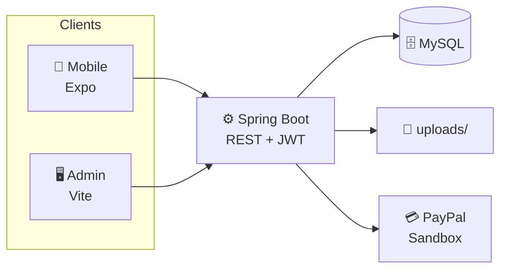

# ViBook

### Discover. Book. Experience.

**A full-stack events marketplace for Jordan — mobile discovery, partner onboarding, and admin moderation in one platform.**

  


Graduation Project
Full Stack

  


Java
Spring Boot
MySQL
Expo
React Native
TypeScript
License

  


[Features](#-features) · [Tech Stack](#-tech-stack) · [Architecture](#-architecture) · [Quick Start](#-quick-start) · [Docs](#-documentation)


---

## 📱 Preview

| Explore | Event Details |
| --- | --- |
| Curated events · governorate & category filters | Gallery · tiers · ratings · booking |
| **Business Hub** | **Admin Dashboard** |
| Partner events & incoming bookings | Analytics · moderation · approvals |

---

## ✨ Features

### 👤 User

- Explore & search events by governorate, category, and subcategory
- Guest browsing with sign-in for bookings, favorites, and reports
- JWT auth — register, login, logout, persisted sessions
- Favorites, bookings (create / view / cancel), and post-booking ratings
- User reports for events, ratings, and bookings
- English & Arabic UI with RTL and light/dark themes

### 🏢 Business Partner

- Apply for a business profile (logo, banner, details) — admin-reviewed
- CRUD events with photos, time slots, hide/unhide
- Manage incoming bookings after approval (`ROLE_BUSINESS`)

### 🛡️ Admin

- Analytics dashboard and governorate stats
- Approve / reject business applications (bulk actions supported)
- Moderate events, bookings, ratings, and user reports
- User management and admin activity log

### ⚙️ Backend

- REST API under `/api/v1` with role-based access control
- MySQL persistence · 19 tables · 18 JPA entities
- Multipart image uploads (profile, business, events)
- PayPal **Sandbox** demo payments for event checkout

**UI-only (not backend-connected yet)**

Premium membership · Wallet · Vouchers · Password reset · Resell — screens exist; billing APIs are planned.


---

## 🛠 Tech Stack

**Backend**

- Java 21 · Spring Boot 3.3.4 · Spring Security · Spring Data JPA
- JWT (JJWT) · BCrypt · Bean Validation · Maven

**Mobile**

- Expo 54 · React Native 0.81 · React 19 · TypeScript
- expo-router · Zustand · AsyncStorage · expo-image · expo-blur

**Admin Dashboard**

- React 19 · TypeScript · Vite · React Router · Axios · Recharts

**Database**

- MySQL 8 (`vibook_db`)

**APIs & Integrations**

- REST `/api/v1/`* · PayPal Sandbox API (demonstration only)

---

## 🏗 Architecture




Layered backend: **Controller → Service → Repository → Entity**

---

## 📂 Project Structure

```
ViBook/
├── backend/          # Spring Boot API, JPA, security, PayPal
│   └── db/schema/    # SQL, ERD, Mermaid diagrams
├── mobile/           # Expo app — consumer + business partner
│   ├── app/          # expo-router screens & tabs
│   └── src/          # api, components, store, i18n, theme
├── admin-web/        # React admin console
└── docs/             # Handoff, remote access, architecture notes
```

---

## 🚀 Quick Start

**Prerequisites:** Java 21 · Node 20+ · MySQL 8

```bash
git clone https://github.com/aya-zidan04/ViBook.git && cd ViBook
```

**Backend** — `cd backend` → `cp .env.example .env` → edit DB + `JWT_SECRET` → `./mvnw spring-boot:run`  
→ `http://localhost:8080/api/v1`

**Mobile** — `cd mobile` → `npm i` → `cp .env.example .env` → set `EXPO_PUBLIC_API_URL` → `npx expo start -c`

**Admin** — `cd admin-web` → `npm i` → `npm run dev`  
→ `http://localhost:5173` (proxies API to :8080)


| App     | Env file         | Key variables                    |
| ------- | ---------------- | -------------------------------- |
| Backend | `backend/.env`   | `DB_`*, `JWT_SECRET`, `PAYPAL_*` |
| Mobile  | `mobile/.env`    | `EXPO_PUBLIC_API_URL`            |
| Admin   | `admin-web/.env` | `VITE_API_BASE_URL` (optional)   |


> Copy from `*.env.example` only — **never commit** real `.env` files.

Physical device? Use your machine's LAN IP in the mobile `.env`. See `[docs/REMOTE_ACCESS.md](docs/REMOTE_ACCESS.md)`.

---

## 🔌 API Overview


| Group                                                           | What it does                          |
| --------------------------------------------------------------- | ------------------------------------- |
| `/auth`                                                         | Register, login, refresh, logout      |
| `/events` · `/categories` · `/governorates`                     | Public catalog                        |
| `/bookings` · `/favorites` · `/users/me`                        | Consumer (JWT)                        |
| `/business-profile` · `/business/events` · `/business/bookings` | Partner hub (JWT)                     |
| `/payments/paypal`                                              | Sandbox checkout (JWT)                |
| `/admin/`*                                                      | Moderation & analytics (`ROLE_ADMIN`) |


Full reference → `[docs/GRADUATION_PROJECT_HANDOFF.md](docs/GRADUATION_PROJECT_HANDOFF.md)`

---

## 🔒 Security

- **JWT** access + refresh tokens · stateless sessions
- **BCrypt** password hashing
- **RBAC** — `ROLE_USER` · `ROLE_BUSINESS` · `ROLE_ADMIN`
- **Secrets** in `.env` (gitignored) — templates in `*.env.example`
- **Upload validation** — MIME whitelist, size limits, UUID filenames, path normalization

---

## 🔮 Future Improvements

- Real PayPal redirect flow (`create-order` → `capture-order`)
- Password reset · premium billing · wallet & vouchers APIs
- Push notifications · rate limiting on auth
- Production migrations (Flyway/Liquibase) · `ddl-auto: validate`
- Admin refresh-token sessions · E2E test suite

---

## 👩‍💻 Developer

**Aya Zidan** — full-stack design & implementation

---

## 📄 License

MIT License — see [LICENSE](LICENSE) or the notice below.

```
Copyright (c) 2026 Aya Zidan
Permission is hereby granted, free of charge, to any person obtaining a copy
of this software to use, modify, and distribute it under the MIT License terms.
```

---

## 🙏 Acknowledgements

Built as a **graduation project** demonstrating end-to-end software engineering — from mobile UX and REST API design to database modeling, authentication, and platform moderation.

---


**ViBook**

*Events marketplace · Jordan*

  


⭐ Star this repo if you found it useful

