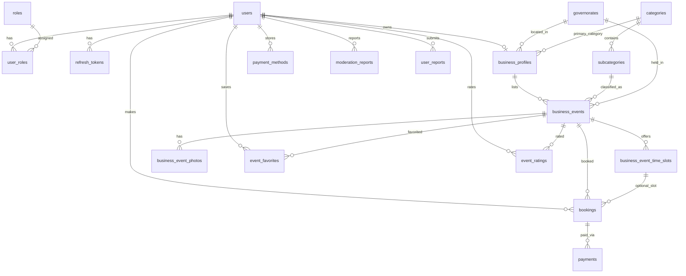

# Vibook Database Schema Package

Complete schema deliverable for **vibook_db** (MySQL 8). Verified against the live database on export.

## Files in this folder

| File | Purpose |
|------|---------|
| `vibook_db_schema.sql` | **Primary artifact** — clean, human-readable `CREATE TABLE` script (19 tables, named constraints). Safe to run on a fresh MySQL 8 instance. |
| `vibook_db_schema_raw.sql` | Raw `mysqldump --no-data` from the live database. Use as a reference diff against the clean script (Hibernate-generated constraint names, column order). |
| `vibook_erd.drawio` | Visual ERD for [diagrams.net](https://app.diagrams.net) / draw.io — 19 table boxes with **24 FK connector lines** (orthogonal routing, color-coded by domain). |
| `relationships.mmd` | Standalone [Mermaid](https://mermaid.js.org) ER diagram for quick viewing in GitHub, VS Code, or any Mermaid renderer. |
| `README.md` | This guide. |

## Database overview

- **Engine:** MySQL 8.0
- **Database name:** `vibook_db`
- **Charset / collation:** `utf8mb4` / `utf8mb4_0900_ai_ci`
- **Table count:** **19**

### Domain groups

| Group | Tables | Count |
|-------|--------|-------|
| **Auth & Users** | `users`, `roles`, `user_roles`, `refresh_tokens` | 4 |
| **Reference Data** | `governorates`, `categories`, `subcategories` | 3 |
| **Business** | `business_profiles`, `business_events`, `business_event_time_slots`, `business_event_photos` | 4 |
| **Consumer** | `bookings`, `payments`, `payment_methods`, `event_favorites`, `event_ratings` | 5 |
| **Admin & Moderation** | `moderation_reports`, `user_reports`, `admin_activity_logs` | 3 |

## Key relationships



### Special cases

- **`admin_activity_logs.admin_user_id`** — stores the acting admin's user ID but has **no foreign key** constraint (audit log retention; avoids cascade issues if a user is removed).
- **`moderation_reports`** — **polymorphic**: `type` + `target_id` reference different entities (`EVENT`, `BOOKING`, `USER`, `BUSINESS_PROFILE`, `RATING`, `OTHER`) without a single FK. Only `reporter_user_id → users.id` is enforced.

### FK summary (23 enforced + 1 logical)

| Child table | FK column | Parent table |
|-------------|-----------|--------------|
| `user_roles` | `user_id` | `users` |
| `user_roles` | `role_id` | `roles` |
| `refresh_tokens` | `user_id` | `users` |
| `subcategories` | `category_id` | `categories` |
| `business_profiles` | `user_id` | `users` |
| `business_profiles` | `governorate_id` | `governorates` |
| `business_profiles` | `primary_category_id` | `categories` |
| `business_events` | `business_profile_id` | `business_profiles` |
| `business_events` | `subcategory_id` | `subcategories` |
| `business_events` | `governorate_id` | `governorates` |
| `business_event_time_slots` | `business_event_id` | `business_events` |
| `business_event_photos` | `business_event_id` | `business_events` |
| `bookings` | `user_id` | `users` |
| `bookings` | `event_id` | `business_events` |
| `bookings` | `time_slot_id` | `business_event_time_slots` |
| `event_favorites` | `user_id` | `users` |
| `event_favorites` | `event_id` | `business_events` |
| `event_ratings` | `user_id` | `users` |
| `event_ratings` | `event_id` | `business_events` |
| `payment_methods` | `user_id` | `users` |
| `payments` | `booking_id` | `bookings` |
| `moderation_reports` | `reporter_user_id` | `users` |
| `user_reports` | `user_id` | `users` |

---

## Open the ERD in diagrams.net / draw.io

1. Go to [https://app.diagrams.net](https://app.diagrams.net) (or open the draw.io desktop app).
2. **File → Open from → Device** (or drag-and-drop).
3. Select `vibook_erd.drawio` from this folder.
4. Zoom to fit: **View → Fit Page** (or `Ctrl/Cmd + Shift + H`).
5. Connector lines use orthogonal routing; FK labels appear on edges. Dashed line = logical reference only (`admin_activity_logs.admin_user_id`).

To edit locally in VS Code, install the **Draw.io Integration** extension and open `vibook_erd.drawio`.

---

## Import SQL in MySQL Workbench

### Option A — Run the clean schema script

1. Open **MySQL Workbench** and connect to your MySQL 8 server.
2. **File → Open SQL Script…** → choose `vibook_db_schema.sql`.
3. Review the script in the editor (creates `vibook_db` if missing, then all 19 tables).
4. Click the **lightning bolt** (Execute) or press `Ctrl/Cmd + Shift + Enter`.
5. Confirm in the **Schemas** panel: `vibook_db` appears with 19 tables.
6. Optional: **File → Export → Export Self-Contained File** to save a backup.

### Option B — Import from live connection (reverse-engineer)

See **Reverse-engineer from live DB** below, then export the model as SQL if needed.

### Command-line alternative

```bash
/usr/local/mysql/bin/mysql -u root -p < backend/db/schema/vibook_db_schema.sql
```

---

## Reverse-engineer from live DB

### MySQL Workbench

1. Connect to the server hosting `vibook_db`.
2. **Database → Reverse Engineer…** (or **Migration → Reverse Engineer** depending on version).
3. Select connection → **Next**.
4. Check **vibook_db** → **Next** through object selection (tables, views, routines as needed).
5. **Execute** → Workbench builds an EER diagram.
6. Arrange tables and use **Model → Create Diagram from Catalog Objects** if needed.
7. **File → Save Model** (`.mwb`) or **File → Export → Forward Engineer SQL** for DDL.

### mysqldump (schema only)

```bash
/usr/local/mysql/bin/mysqldump -u root -p --no-data vibook_db > vibook_db_schema_raw.sql
```

This folder already includes a snapshot as `vibook_db_schema_raw.sql`.

### Compare clean vs live

```bash
diff <(grep -E 'CREATE TABLE|CONSTRAINT|UNIQUE|PRIMARY' vibook_db_schema.sql | sort) \
     <(grep -E 'CREATE TABLE|CONSTRAINT|UNIQUE|PRIMARY' vibook_db_schema_raw.sql | sort)
```

Structural differences are expected: the clean script uses readable constraint names (`fk_bookings_user`) while the live/Hibernate dump uses generated names (`FKeyog2oic85xg7hsu2je2lx3s6`). Column types, nullability, and relationships match.

---

## Regenerating this package

From the project root, with MySQL running and credentials from `backend/.env`:

```bash
# Refresh raw dump
/usr/local/mysql/bin/mysqldump -u root -p1234 --no-data vibook_db \
  > backend/db/schema/vibook_db_schema_raw.sql

# Verify table count
/usr/local/mysql/bin/mysql -u root -p1234 -N -e \
  "SELECT COUNT(*) FROM information_schema.TABLES WHERE TABLE_SCHEMA='vibook_db';"
```

After schema migrations, update `vibook_db_schema.sql`, re-export the draw.io ERD edges, and refresh `relationships.mmd` to stay in sync.
