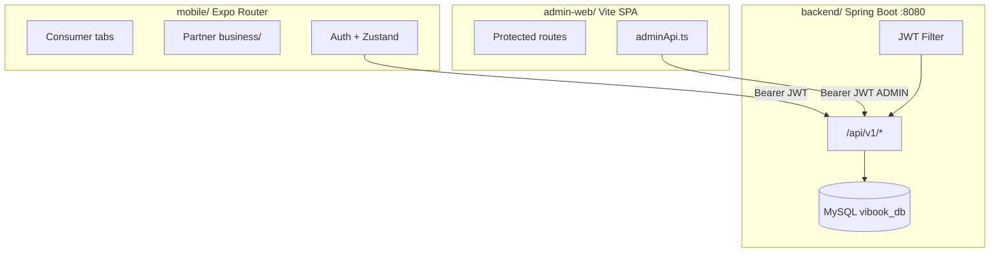

# Vibook — Complete Graduation Project Handoff Documentation

**Repository root:** `/Users/ayazidan/Downloads/Vibook-main/Vibook`  
**Generated from:** actual source code (backend, `mobile/`, `admin-web/`) — not inferred.  
**Date:** May 2026

---

# 1. Project Overview

## What is the application?

**Vibook** is a full-stack lifestyle booking platform inspired by regional discovery apps (e.g. WeBook-style). It lets consumers browse and book **events** in Jordan, while **business partners** apply to list events and manage bookings. **Administrators** operate a separate web console for moderation, analytics, and platform configuration.

The product is implemented as three deployable parts:


| Part          | Path         | Role                                            |
| ------------- | ------------ | ----------------------------------------------- |
| Mobile app    | `mobile/`    | Expo/React Native consumer + partner experience |
| Backend API   | `backend/`   | Spring Boot REST API, MySQL, JWT auth           |
| Admin console | `admin-web/` | React SPA for platform operators                |


## Main purpose

Connect **guests and registered users** with **bookable business events**, with **trust and safety** via ratings and moderation reports, and **governed onboarding** for business profiles.

## Target users


| Persona             | Description                                                                             |
| ------------------- | --------------------------------------------------------------------------------------- |
| **Guest**           | Browse without login (`appStore.isGuest`); limited booking/reporting                    |
| **Consumer (USER)** | Register, book events, favorites, ratings, reports                                      |
| **Business owner**  | Same USER account; applies for `BusinessProfile`; manages events/bookings when approved |
| **Admin (ADMIN)**   | Web-only; moderates profiles, events, bookings, ratings, reports                        |


## Business idea

A **single marketplace** for timed experiences (events) in Jordan, with:

- Geographic filtering via **governorates**
- Taxonomy via **categories / subcategories**
- Partner self-service after admin approval
- Platform oversight via admin moderation and user reports

## Main use cases

1. Discover events on Explore (filter by governorate/category).
2. View event PDP, favorite, rate, book, cancel booking.
3. Report inappropriate events, ratings, or bookings.
4. Apply as a business → admin approves → create/hide events → manage incoming bookings.
5. Admin reviews pending businesses, moderates content, resolves user reports, views analytics.

## Core features


| Area                                               | Status (code-backed)                                     |
| -------------------------------------------------- | -------------------------------------------------------- |
| JWT auth + refresh tokens                          | ✅ Backend + mobile + admin                               |
| Public event catalog (`GET /events`)               | ✅                                                        |
| Consumer bookings                                  | ✅ API; mobile `payment.tsx` for numeric event IDs        |
| Favorites                                          | ✅ API + mobile                                           |
| Event ratings                                      | ✅ API; PDP uses server rating + `myRatingId`             |
| Moderation reports (user → admin queue)            | ✅                                                        |
| Business profile application & approval            | ✅                                                        |
| Partner event CRUD + hide/unhide                   | ✅                                                        |
| Partner booking status updates                     | ✅                                                        |
| Admin dashboard analytics                          | ✅ `GET /admin/analytics/summary`                         |
| Runtime mock catalog                               | ✅ Removed — API-only for in-scope data (`PRODUCTION_DATA_CLEANUP_REPORT.md`) |
| Premium / wallet / vouchers (mobile UI)            | ✅ **Static presentation** — not paid backend features |
| Legacy PDP routes (restaurant/stay/etc.)           | ✅ UI shells only — **out of product scope** |
| Event photo multipart upload                       | ✅ Partner event photo endpoints + mobile |
| `ROLE_BUSINESS` on business approval               | ✅ Granted/revoked with profile lifecycle |


---

# 2. System Architecture

## Overall flow




## Repository folder structure

```
Vibook/
├── backend/                 # Spring Boot 3, Java, JPA, MySQL
│   └── src/main/java/com/vibook/backend/
│       ├── config/          # Security, CORS, seeders, static files
│       ├── controller/      # 23 REST controllers
│       ├── dto/             # 55 request/response records
│       ├── entity/          # 16 JPA entities + 6 enums
│       ├── repository/      # Spring Data JPA
│       ├── service/ + impl/
│       ├── security/        # JWT filter, UserDetails
│       ├── exception/       # GlobalExceptionHandler
│       ├── mapper/
│       └── spec/            # JPA Specifications for admin filters
├── mobile/                  # Expo SDK 54, expo-router
│   ├── app/                 # File-based routes
│   └── src/
│       ├── api/             # HTTP clients
│       ├── store/           # Zustand + AsyncStorage
│       ├── services/        # Mappers, sync, mock re-exports
│       ├── api/             # HTTP clients (catalog, auth, business)
│       ├── components/
│       ├── hooks/
│       ├── i18n/
│       └── theme/
├── admin-web/               # Vite + React 19 + React Router 7
│   └── src/
│       ├── pages/
│       ├── api/
│       ├── auth/
│       └── components/
└── docs/
    ├── MOBILE_AND_ADMIN_GUIDE.md
    └── GRADUATION_PROJECT_HANDOFF.md  # this file
```

## Tech stack


| Layer       | Technologies                                                                                                                                     |
| ----------- | ------------------------------------------------------------------------------------------------------------------------------------------------ |
| **Mobile**  | Expo ~54, React Native 0.81, React 19, TypeScript, expo-router, Zustand, AsyncStorage, expo-image, expo-linear-gradient, react-native-reanimated |
| **Backend** | Spring Boot, Spring Security, Spring Data JPA, Hibernate, MySQL, JJWT, BCrypt, Jakarta Validation                                                |
| **Admin**   | Vite 8, React 19, TypeScript, Axios, React Router 7, Recharts                                                                                    |


## Environment variables & configuration

### Mobile (`mobile/.env.example`)


| Variable              | Purpose                                                                  |
| --------------------- | ------------------------------------------------------------------------ |
| `EXPO_PUBLIC_API_URL` | Full API base including `/api/v1`, e.g. `http://192.168.x.x:8080/api/v1` |


Read in: `mobile/src/api/env.ts` → `getApiBaseUrl()`.

### Admin (`admin-web/.env.example`)


| Variable            | Purpose                                                      |
| ------------------- | ------------------------------------------------------------ |
| `VITE_API_BASE_URL` | Optional; `http://localhost:8080` — client appends `/api/v1` |


Read in: `admin-web/src/api/client.ts`. Dev proxy: `admin-web/vite.config.ts` → `:8080`.

### Backend (`backend/src/main/resources/application.yml`)


| Key                                   | Value / role                                               |
| ------------------------------------- | ---------------------------------------------------------- |
| `server.port`                         | `8080`                                                     |
| `spring.datasource.*`                 | MySQL `vibook_db` (default user `root` / password in YAML) |
| `spring.jpa.hibernate.ddl-auto`       | `update`                                                   |
| `app.jwt.secret`                      | Base64 HMAC key                                            |
| `app.jwt.expiration-ms`               | `86400000` (24h access token)                              |
| `app.upload.*`                        | Profile images, business logos/banners directories         |
| `vibook.cors.allowed-origin-patterns` | Localhost + LAN for mobile/admin                           |
| Multipart limits                      | 5MB file / 6MB request                                     |


Static files served at: `/api/v1/files/profile-images/`**, `business-logos/`**, `business-banners/**` via `StaticResourceConfig.java`.

---

# 3. Mobile Application Analysis

**Root:** `mobile/`  
**Entry:** `package.json` → `"main": "expo-router/entry"`  
**Path alias:** `@/*` → `src/*` (`tsconfig.json`)

## Navigation architecture

Root **Stack** in `app/_layout.tsx` wraps:

- `RtlLayout` (RTL for Arabic)
- Theme-aware status bar
- Routes: splash, entry, auth group, tabs, business stack, modals/stacks for PDP/checkout/account

### Cold start flow

1. `app/index.tsx` — splash; `hydrateAuthSession()` + `loadReferenceData()`
2. If `!hasCompletedOnboarding` → `/entry`
3. Else → `/(tabs)/explore`

### Guest flow

- `app/entry.tsx` — carousel; **Browse as guest** sets guest mode and opens Explore without full session
- `appStore`: `isGuest: true`, `isAuthenticated: false` until login
- Explore can load public-adjacent data; **bookings, favorites, reports, rate** require auth (API returns 401; UI should gate — check per screen)

### Authentication flow


| Step              | File                                                                   |
| ----------------- | ---------------------------------------------------------------------- |
| Persist tokens    | `src/api/authSession.ts` key `vibook-auth-tokens`                      |
| Login/register    | `app/(auth)/login.tsx`, `signup.tsx` → `authApi.ts`                    |
| Hydrate on launch | `src/bootstrap/hydrateAuthSession.ts` → `GET /users/me`                |
| HTTP + refresh    | `src/api/http.ts` — Bearer header; on 401 → `POST /auth/refresh`       |
| Session user      | `src/store/sessionStore.ts` (memory)                                   |
| App flags         | `src/store/appStore.ts` — `isAuthenticated`, logout clears stores      |
| Logout            | `POST /auth/logout` + clear tokens, favorites reset, hub lists cleared |


### Business user flow

See **Section 7**. Routes under `app/business/`.

### Tabs and routes (consumer)


| Tab       | File                   | Route               |
| --------- | ---------------------- | ------------------- |
| Explore   | `(tabs)/explore.tsx`   | `/(tabs)/explore`   |
| Booking   | `(tabs)/booking.tsx`   | `/(tabs)/booking`   |
| Favorites | `(tabs)/favorites.tsx` | `/(tabs)/favorites` |
| Me        | `(tabs)/me.tsx`        | `/(tabs)/me`        |


`(tabs)/_layout.tsx` forces **LTR tab bar** even in Arabic (`ltrNavigationChrome` pattern).

## State management (Zustand)


| Store                       | File                         | AsyncStorage key           | Persisted fields                                                                          |
| --------------------------- | ---------------------------- | -------------------------- | ----------------------------------------------------------------------------------------- |
| App                         | `store/appStore.ts`          | `vibook-storage`           | `selectedCityId`, `hasCompletedOnboarding`, `isAuthenticated`, `pushNotificationsEnabled` |
| Session                     | `store/sessionStore.ts`      | —                          | `serverUser` (runtime)                                                                    |
| Locale                      | `store/localeStore.ts`       | `vibook-locale`            | `locale`, `currency`, `regionLabel`                                                       |
| Theme                       | `store/themeStore.ts`        | `vibook-theme`             | `colorScheme`                                                                             |
| Favorites                   | `store/favoritesStore.ts`    | `vibook-favorites`         | Favorite keys                                                                             |
| User ratings (legacy local) | `store/userRatingsStore.ts`  | `vibook-user-ratings`      | Local stars (API ratings primary on PDP)                                                  |
| Profile overrides           | `store/userProfileStore.ts`  | `vibook-profile-overrides` | Local display overrides                                                                   |
| Business hub                | `store/businessHubStore.ts`  | `vibook-business-hub-v2`   | `applicationStatus`, `profile`, `listings` — **not** events/bookings                      |
| Booking draft               | `store/bookingDraftStore.ts` | —                          | Checkout draft                                                                            |
| Reference                   | `store/referenceStore.ts`    | —                          | API-loaded cities/categories                                                              |


**Tokens:** separate from Zustand in `authSession.ts`.

## Services layer


| Service               | Path                                 | Role                                  |
| --------------------- | ------------------------------------ | ------------------------------------- |
| Hub sync              | `services/businessHubSync.ts`        | `refreshBusinessHubLists()`           |
| Event/booking mappers | `utils/businessHubMappers.ts`        | DTO → hub records                     |
| API event map         | `services/api/eventMap.ts`           | `BusinessEventResponse` → `EventItem` |
| Booking map           | `services/api/bookingMap.ts`         | `BookingResponse` → app `Booking`     |
| Catalog map           | `services/catalog/mapCatalog.ts`     | Numeric event IDs → API routes        |
| Reference map         | `services/reference/mapReference.ts` | Governorates/categories               |
| Profile merge         | `services/profileMerge.ts`           | Temporary overrides + server profile  |


## API vs presentation-only UI

**In-scope data** uses the live API (`referenceStore`, `searchEvents`, `GET /events/{id}`, bookings, favorites, business hub).

| Feature                                     | API                      | Presentation-only UI                |
| ------------------------------------------- | ------------------------ | --------------------------------- |
| Auth, profile                               | ✅                        | —                                 |
| Explore / search / filters / event PDP      | ✅                        | —                                 |
| Payment/booking (events)                    | ✅ PayPal + bookings API  | —                                 |
| Favorites, ratings, reports                 | ✅                        | —                                 |
| Partner hub events/bookings                 | ✅                        | —                                 |
| Premium membership, resell entry              | —                        | ✅ Static plans/copy (no billing) |
| Wallet, vouchers                            | —                        | ✅ Static screens                 |
| Restaurant/stay/experience/package/organizer  | —                        | ✅ Legacy routes (not-found)      |
| Notifications                               | —                        | ✅ Static i18n                    |


## Localization & RTL


| File                                  | Role                                 |
| ------------------------------------- | ------------------------------------ |
| `src/i18n/dictionary.ts`              | Nested `en` / `ar` strings           |
| `src/i18n/useTranslation.ts`          | `t()`, `locale`, `currency`, `isRTL` |
| `src/components/layout/RtlLayout.tsx` | `I18nManager.forceRTL` when `ar`     |
| `src/utils/rtl.ts`                    | Chevron direction                    |
| `src/utils/currencyDisplay.ts`        | JOD/USD formatting                   |
| `app/language-currency.tsx`           | User-facing switcher                 |


## Expo setup

- `app.json` / Expo config in `mobile/`
- Plugins: expo-router, image-picker, etc. (see `mobile/package.json`)
- Scripts: `npx expo start`, `npm run start:8085` if port busy

---

## Mobile screens reference

Columns: **Route file** | **Purpose** | **APIs** | **Stores / hooks** | **Key components**

### Bootstrap & auth


| Screen file              | Purpose                          | APIs                                      | State                                        | Components      |
| ------------------------ | -------------------------------- | ----------------------------------------- | -------------------------------------------- | --------------- |
| `app/index.tsx`          | Splash, hydrate auth & reference | `GET /users/me`, governorates, categories | `appStore`, `sessionStore`, `referenceStore` | Brand splash    |
| `app/entry.tsx`          | First-run carousel               | —                                         | `appStore`                                   | Carousel, CTAs  |
| `app/onboarding.tsx`     | Legacy redirect → `/entry`       | —                                         | —                                            | —               |
| `app/(auth)/welcome.tsx` | Secondary welcome                | —                                         | `appStore`                                   | —               |
| `app/(auth)/login.tsx`   | Login                            | `POST /auth/login`, `GET /users/me`       | `appStore`, `sessionStore`, tokens           | `AuthTextField` |
| `app/(auth)/signup.tsx`  | Register                         | `POST /auth/register`                     | same                                         | `AuthTextField` |


### Main tabs


| Screen file                | Purpose          | APIs                                                | State                                     | Components                                                                             |
| -------------------------- | ---------------- | --------------------------------------------------- | ----------------------------------------- | -------------------------------------------------------------------------------------- |
| `app/(tabs)/explore.tsx`   | Home discovery   | `GET /events`, `GET /categories/{id}/subcategories` | `appStore`, `referenceStore`              | `ExploreHeader`, `ExploreHeroCarousel`, `ExploreCategoryStrip`, `ExploreEventFeedCard` |
| `app/(tabs)/booking.tsx`   | My bookings list | `GET /bookings/me`                                  | `sessionStore`                            | Booking cards                                                                          |
| `app/(tabs)/favorites.tsx` | Saved events     | `GET /favorites`                                    | `favoritesStore`                          | Favorite cards                                                                         |
| `app/(tabs)/me.tsx`        | Profile hub      | Session / profile APIs when signed in               | `useCurrentUser`, `sessionStore`          | Menu, partner CTA, Premium navigation (static UI)                                      |


### Discovery & PDP


| Screen file               | Purpose               | APIs                                           | State                          | Components                                      |
| ------------------------- | --------------------- | ---------------------------------------------- | ------------------------------ | ----------------------------------------------- |
| `app/search.tsx`          | Event search          | `GET /events` (keyword/filters)                | `referenceStore`, search store | Search UI                                       |
| `app/filters.tsx`         | Filter chips          | Categories/subcategories from API              | `referenceStore`               | —                                               |
| `app/event/[id].tsx`      | Event PDP             | `GET /events/{id}`, rate, favorites            | `bookingDraftStore`, favorites | `StarRatingInput`, `ReportIssueModal`, book CTA |
| `app/restaurant/[id].tsx` | Legacy PDP shell      | — (out of scope)                               | —                              | Not-found / presentation                        |
| `app/stay/[id].tsx`       | Legacy PDP shell      | — (out of scope)                               | —                              | Same                                            |
| `app/experience/[id].tsx` | Legacy PDP shell      | — (out of scope)                               | —                              | Same                                            |
| `app/package/[id].tsx`    | Legacy PDP shell      | — (out of scope)                               | —                              | Same                                            |
| `app/organizer/[id].tsx`  | Legacy PDP shell      | — (out of scope)                               | —                              | Same                                            |


### Booking commerce


| Screen file            | Purpose              | APIs                                                | State               | Components                        |
| ---------------------- | -------------------- | --------------------------------------------------- | ------------------- | --------------------------------- |
| `app/checkout.tsx`     | Order summary        | —                                                   | `bookingDraftStore` | —                                 |
| `app/payment.tsx`      | Pay / submit booking | `POST /bookings` if `apiEventId`                    | `bookingDraftStore` | Fake card UI                      |
| `app/confirmation.tsx` | Success              | —                                                   | `lastOrderId`       | —                                 |
| `app/booking/[id].tsx` | Booking detail       | `GET /bookings/me/{id}`, `PATCH .../cancel`, report | —                   | `ReportIssueModal` |


### Account & settings


| Screen file                  | Purpose           | APIs                               | State                              | Components       |
| ---------------------------- | ----------------- | ---------------------------------- | ---------------------------------- | ---------------- |
| `app/edit-profile.tsx`       | Edit user         | `GET /users/me`, `PUT /users/{id}` | `sessionStore`, `userProfileStore` | Form fields      |
| `app/settings.tsx`           | Settings links    | —                                  | `appStore`                         | —                |
| `app/appearance.tsx`         | Theme             | —                                  | `themeStore`                       | —                |
| `app/language-currency.tsx`  | Locale/currency   | —                                  | `localeStore`                      | —                |
| `app/notifications.tsx`      | Notification list | — (i18n keys only)                 | —                                  | —                |
| `app/payment-methods.tsx`    | Saved cards       | `GET /users/me/payment-methods`    | —                                  | —                |
| `app/add-payment-method.tsx` | Add card          | `POST /users/me/payment-methods`   | —                                  | —                |
| `app/wallet.tsx`             | Wallet (static UI)| —                                  | `useCurrentUser` (display)         | —                |
| `app/vouchers.tsx`           | Vouchers (static) | —                                  | —                                  | —                |
| `app/membership/index.tsx`   | Premium hub       | — (static UI)                      | `useCurrentUser`                   | Plans navigation |
| `app/membership/plans.tsx`   | Premium plans     | — (static UI)                      | —                                  | —                |
| `app/help.tsx`               | FAQ               | —                                  | —                                  | —                |
| `app/about.tsx`              | About             | —                                  | —                                  | —                |
| `app/favorites.tsx`          | Redirect          | —                                  | —                                  | → tabs favorites |


### Business partner


| Screen file                                 | Purpose                | APIs                                           | State              | Components                           |
| ------------------------------------------- | ---------------------- | ---------------------------------------------- | ------------------ | ------------------------------------ |
| `app/business/index.tsx`                    | Partner intro / router | —                                              | `businessHubStore` | —                                    |
| `app/business/join.tsx`                     | Application            | `PUT /business-profile/me`, `PATCH .../submit` | hub store          | `GovernorateSelectField`, categories |
| `app/business/application-pending.tsx`      | Waiting                | `GET /business-profile/me`                     | hub store          | —                                    |
| `app/business/application-rejected.tsx`     | Rejected               | `GET /business-profile/me`                     | hub store          | —                                    |
| `app/business/(dashboard)/home.tsx`         | Dashboard              | — (reads hub lists)                            | `businessHubStore` | `MicroBars`, `MicroSparkline`        |
| `app/business/(dashboard)/events/index.tsx` | Event list             | hide/unhide + sync                             | hub store          | —                                    |
| `app/business/(dashboard)/events/[id].tsx`  | Event editor           | CRUD `business/events`                         | hub store          | `EventPhotosField`, calendar sheets  |
| `app/business/(dashboard)/bookings.tsx`     | Partner bookings       | `PATCH /business/bookings/{id}/status`         | hub store          | —                                    |
| `app/business/(dashboard)/profile.tsx`      | Partner brand UI       | Mostly local store                             | `businessHubStore` | —                                    |


**Layouts:** `business/_layout.tsx` syncs approval from API; `(dashboard)/_layout.tsx` calls `refreshBusinessHubLists()` on focus.

---

# 4. Backend Analysis

**Base package:** `com.vibook.backend`  
**Application class:** `BackendApplication.java`  
**API prefix:** `/api/v1`  
**Controllers:** 23 classes in `controller/`  
**Services:** interfaces in `service/`, implementations in `service/impl/`

## Package structure


| Package            | Count                 | Responsibility                            |
| ------------------ | --------------------- | ----------------------------------------- |
| `config`           | 10                    | Security, CORS, seeders, static resources |
| `controller`       | 23                    | REST endpoints                            |
| `dto`              | 55                    | Request/response records + validation     |
| `entity`           | 16 entities + 6 enums | JPA model                                 |
| `repository`       | 15                    | Spring Data                               |
| `service` / `impl` | 25 each               | Business logic                            |
| `security`         | 4                     | JWT filter, `AuthenticatedUser`           |
| `exception`        | 6                     | `@RestControllerAdvice`                   |
| `mapper`           | 9                     | Entity ↔ DTO                              |
| `spec`             | 5                     | Admin list filters                        |


## Security (`config/SecurityConfig.java`)

- **Stateless** JWT sessions
- **BCrypt** passwords via `DaoAuthenticationProvider`
- **Filter:** `JwtAuthenticationFilter` before `UsernamePasswordAuthenticationFilter`
- **Entry point:** `RestAuthenticationEntryPoint` → 401 JSON
- `**@EnableMethodSecurity`** for method-level checks where used

### Public endpoints (no JWT)

- `POST /auth/register`, `/login`, `/refresh`, `/logout`
- `GET /categories/`**, `GET /governorates/`**
- `GET /api/v1/files/profile-images/**`, `business-logos/**`, `business-banners/**`
- `/error`

### Role-protected patterns (summary)


| Pattern                                                  | Roles                        |
| -------------------------------------------------------- | ---------------------------- |
| `/admin/**`                                              | `ADMIN`                      |
| `/bookings/**`, `/favorites/**`, `/business/bookings/**` | `USER`, `ADMIN`              |
| `GET/POST /events/**` (catalog + rate)                   | `USER`, `ADMIN`              |
| `POST /reports`                                          | `USER`, `ADMIN`              |
| `/business-profile/me/**`, `/business/events/**`         | `USER` (+ admin where noted) |
| `/users/me/**`, payment methods                          | `USER`                       |
| `POST /governorates`, PUT/DELETE governorates            | `ADMIN`                      |
| `GET /users`, admin user patches                         | `ADMIN`                      |


**Note:** `ROLE_BUSINESS` exists in `RoleSeederConfig` but partner routes use `**USER`** + ownership checks in services.

## JWT implementation


| Component                 | File                                                       |
| ------------------------- | ---------------------------------------------------------- |
| Token creation/validation | `service/impl/JwtServiceImpl.java`                         |
| Filter                    | `security/JwtAuthenticationFilter.java`                    |
| Principal                 | `security/AuthenticatedUser.java`                          |
| User load                 | `security/CustomUserDetailsService.java`                   |
| Auth orchestration        | `service/impl/AuthServiceImpl.java`                        |
| Refresh tokens            | `entity/RefreshToken.java`, `RefreshTokenServiceImpl.java` |


Access token: subject = email, claim `roles`, expiry from `app.jwt.expiration-ms`.  
Refresh token: UUID in DB, 30-day expiry, revocable on logout.

## Exception handling

**File:** `exception/GlobalExceptionHandler.java` (`@RestControllerAdvice`)

Returns `ErrorResponse` with timestamp, status, title, message, path, optional field errors.


| Exception                                        | HTTP |
| ------------------------------------------------ | ---- |
| `MethodArgumentNotValidException`                | 400  |
| `BadRequestException`                            | 400  |
| `NotFoundException`, `ResourceNotFoundException` | 404  |
| `ForbiddenException`, `AccessDeniedException`    | 403  |
| `UnauthorizedException`                          | 401  |
| `DataIntegrityViolationException`                | 409  |
| `Exception`                                      | 500  |


## File uploads


| Endpoint                           | Part    | Storage                     |
| ---------------------------------- | ------- | --------------------------- |
| `POST /users/me/profile-image`     | `image` | `uploads/profile-images/`   |
| `POST /business-profile/me/logo`   | `image` | `uploads/business-logos/`   |
| `POST /business-profile/me/banner` | `image` | `uploads/business-banners/` |


**Not multipart:** event photos — `BusinessEventUpsertRequest.photoUrls` (URL strings only).

---

## Complete API catalog

Below: **Method**, **URL**, **Auth**, **Request**, **Response**, **Logic** (concise).  
Implementations primarily in `service/impl/`*.

### Auth — `AuthController` `/api/v1/auth`


| Method | URL           | Auth          | Request                                                                            | Response               | Logic                                          |
| ------ | ------------- | ------------- | ---------------------------------------------------------------------------------- | ---------------------- | ---------------------------------------------- |
| POST   | `/register`   | Public        | `RegisterRequest`: firstName, lastName, email, password (8–64, upper+digit), phone | `AuthResponse`         | Create user + `ROLE_USER`, issue JWT + refresh |
| POST   | `/login`      | Public        | `LoginRequest`: email, password                                                    | `AuthResponse`         | Authenticate, issue tokens                     |
| POST   | `/refresh`    | Public        | `RefreshTokenRequest`: refreshToken                                                | `TokenRefreshResponse` | Validate refresh row, new access JWT           |
| POST   | `/logout`     | Public        | `LogoutRequest`: refreshToken                                                      | 204                    | Revoke refresh token                           |
| POST   | `/logout-all` | Authenticated | —                                                                                  | 204                    | Revoke all refresh tokens for user             |


### Users — `UserController` `/api/v1/users`


| Method | URL                 | Auth  | Request             | Response             |
| ------ | ------------------- | ----- | ------------------- | -------------------- |
| GET    | `/me`               | USER  | —                   | `UserResponse`       |
| POST   | `/me/profile-image` | USER  | multipart `image`   | `UserResponse`       |
| DELETE | `/me/profile-image` | USER  | —                   | `UserResponse`       |
| GET    | `/`                 | ADMIN | —                   | `List<UserResponse>` |
| GET    | `/{id}`             | ADMIN | —                   | `UserResponse`       |
| PUT    | `/{id}`             | USER  | `UpdateUserRequest` | `UserResponse`       |
| DELETE | `/{id}`             | ADMIN | —                   | disable user         |


### Payment methods — `PaymentMethodController` `/api/v1/users/me/payment-methods`


| Method | URL             | Auth | Request                   | Response                |
| ------ | --------------- | ---- | ------------------------- | ----------------------- |
| POST   | `/`             | USER | `AddPaymentMethodRequest` | `PaymentMethodResponse` |
| GET    | `/`             | USER | —                         | list                    |
| PATCH  | `/{id}/default` | USER | —                         | `PaymentMethodResponse` |
| DELETE | `/{id}`         | USER | —                         | 204                     |


### Business profile — `BusinessProfileController` `/api/v1/business-profile`


| Method      | URL                      | Auth | Request                        | Response                  | Logic                  |
| ----------- | ------------------------ | ---- | ------------------------------ | ------------------------- | ---------------------- |
| GET         | `/me`                    | USER | —                              | `BusinessProfileResponse` | Owner's profile or 404 |
| PUT         | `/me`                    | USER | `BusinessProfileUpsertRequest` | `BusinessProfileResponse` | Upsert; may stay DRAFT |
| PATCH       | `/me/submit`             | USER | —                              | `BusinessProfileResponse` | → `PENDING_REVIEW`     |
| POST/DELETE | `/me/logo`, `/me/banner` | USER | multipart                      | `BusinessProfileResponse` | File storage           |


### Business events — `BusinessEventController` `/api/v1/business/events`


| Method | URL                     | Auth       | Request                      | Response                             | Logic                         |
| ------ | ----------------------- | ---------- | ---------------------------- | ------------------------------------ | ----------------------------- |
| POST   | `/`                     | USER       | `BusinessEventUpsertRequest` | `BusinessEventResponse`              | Requires **APPROVED** profile |
| GET    | `/`                     | USER       | —                            | `List<BusinessEventSummaryResponse>` | Owner's events                |
| GET    | `/{id}`                 | USER/ADMIN | —                            | `BusinessEventResponse`              | Owner or admin                |
| PUT    | `/{id}`                 | USER       | `BusinessEventUpsertRequest` | `BusinessEventResponse`              | Full replace                  |
| DELETE | `/{id}`                 | USER       | —                            | 204                                  | Delete                        |
| PATCH  | `/{id}/hide`, `/unhide` | USER       | —                            | `BusinessEventResponse`              | Visibility                    |


`**BusinessEventUpsertRequest` fields:** title, subcategoryId, description, eventDate, timeSlots[], governorateId, googleMapsUrl, priceJod, currency, capacityGuests, hidden, photoUrls[].

### Business bookings — `BusinessBookingController` `/api/v1/business/bookings`


| Method | URL            | Auth | Request                                 | Response                | Logic                                |
| ------ | -------------- | ---- | --------------------------------------- | ----------------------- | ------------------------------------ |
| GET    | `/`            | USER | —                                       | `List<BookingResponse>` | Bookings on owner's events           |
| GET    | `/{id}`        | USER | —                                       | `BookingResponse`       |                                      |
| PATCH  | `/{id}/status` | USER | `BookingStatusUpdateRequest` { status } | `BookingResponse`       | Partner transitions (not to PENDING) |


### Consumer bookings — `BookingController` `/api/v1/bookings`


| Method | URL               | Auth | Request                                                          | Response          | Logic                   |
| ------ | ----------------- | ---- | ---------------------------------------------------------------- | ----------------- | ----------------------- |
| POST   | `/`               | USER | `BookingCreateRequest`: eventId, timeSlotId?, guestsCount, note? | `BookingResponse` | Creates PENDING booking |
| GET    | `/me`             | USER | —                                                                | list              |                         |
| GET    | `/me/{id}`        | USER | —                                                                | `BookingResponse` |                         |
| PATCH  | `/me/{id}/cancel` | USER | `CancelBookingRequest`?                                          | `BookingResponse` | User cancel             |


### Events (catalog + ratings) — `EventRatingController` `/api/v1/events`


| Method | URL               | Auth       | Request                                    | Response                | Logic                                   |
| ------ | ----------------- | ---------- | ------------------------------------------ | ----------------------- | --------------------------------------- |
| GET    | `/`               | USER/ADMIN | query params (governorate, category, etc.) | `Page` of events        | Public catalog for app                  |
| GET    | `/{eventId}`      | USER/ADMIN | —                                          | `BusinessEventResponse` | Includes myRating, myRatingId, canRate  |
| POST   | `/{eventId}/rate` | USER       | `EventRatingRequest` { ratingValue }       | `EventRatingResponse`   | Upsert rating; updates event aggregates |


### Favorites — `FavoriteController` `/api/v1/favorites`


| Method | URL                 | Auth | Response                      |
| ------ | ------------------- | ---- | ----------------------------- |
| GET    | `/{eventId}/status` | USER | `FavoriteStatusResponse`      |
| GET    | `/`                 | USER | `List<FavoriteEventResponse>` |
| POST   | `/{eventId}`        | USER | `FavoriteResponse`            |
| DELETE | `/{eventId}`        | USER | 204                           |


### Categories — `CategoryController` `/api/v1/categories`

| GET | `/`, `/slug/{slug}`, `/{id}/subcategories` | Public |

### Governorates — `GovernorateController` `/api/v1/governorates`

| GET | `/`, `/active`, `/{id}` | Public |
| POST, PUT, DELETE | | ADMIN |

### Reports — `ModerationReportController` `/api/v1/reports`

| POST | `/` | USER/ADMIN | `CreateModerationReportRequest`: targetType, targetId?, reason, description? | `ModerationReportCreatedResponse` | Validates target exists |

### Admin endpoints (all `ROLE_ADMIN`)

Grouped by controller; see `admin-web/src/api/adminApi.ts` for 1:1 client mapping.

- **Business profiles:** list/filter, get, approve, reject, notes, bulk approve/reject
- **Events:** list/filter, get, hide/show, delete, notes
- **Bookings:** list/filter, get, cancel, complete
- **Ratings:** list/filter, delete, hide
- **Reports:** list, get, review, resolve, dismiss
- **Categories:** CRUD
- **Users:** patch roles, enable/disable
- **Dashboard:** `GET /admin/analytics/summary` (legacy `/admin/dashboard/stats` removed)
- **Analytics:** `GET /admin/analytics/summary`
- **Activity log:** `GET /admin/activity-log`
- **Governorate stats:** `GET /admin/governorates/stats`

---

# 5. Database Analysis

**Database:** MySQL `vibook_db` (from `application.yml`)  
**DDL:** Hibernate `ddl-auto: update` (dev-style; production should use migrations)

## ERD (conceptual)

```mermaid
erDiagram
  User ||--o{ user_roles }o--|| Role
  User ||--o| BusinessProfile : owns
  User ||--o{ Booking : makes
  User ||--o{ Favorite : saves
  User ||--o{ EventRating : writes
  User ||--o{ PaymentMethod : has
  User ||--o{ RefreshToken : has
  User ||--o{ ModerationReport : files
  BusinessProfile }o--|| Category : primaryCategory
  BusinessProfile }o--|| Governorate : located
  BusinessProfile ||--o{ BusinessEvent : lists
  BusinessEvent }o--|| Subcategory : typed
  BusinessEvent }o--|| Governorate : in
  BusinessEvent ||--o{ BusinessEventTimeSlot : slots
  BusinessEvent ||--o{ BusinessEventPhoto : photos
  BusinessEvent ||--o{ Booking : receives
  BusinessEvent ||--o{ EventRating : rated
  BusinessEvent ||--o{ Favorite : favorited
  Category ||--o{ Subcategory : contains
  Booking }o--o| BusinessEventTimeSlot : optional_slot
```


## Entities (tables)

### `users` — `User.java`


| Field                | Type       | Notes                               |
| -------------------- | ---------- | ----------------------------------- |
| id                   | Long PK    | IDENTITY                            |
| firstName, lastName  | String     | max 80                              |
| email                | String     | unique                              |
| password             | String     | BCrypt                              |
| phone                | String     |                                     |
| profileImageUrl      | String?    | path under `/files/profile-images/` |
| enabled              | boolean    | default true                        |
| createdAt, updatedAt | Instant    | `@PrePersist` / `@PreUpdate`        |
| roles                | ManyToMany | `user_roles` join table             |


### `roles` — `Role.java`


| Field | Notes                   |
| ----- | ----------------------- |
| id    | PK                      |
| name  | `RoleName` enum, unique |


### `business_profiles` — `BusinessProfile.java`


| Field                                 | Notes                        |
| ------------------------------------- | ---------------------------- |
| user_id                               | OneToOne unique → User       |
| businessName                          | required                     |
| tagline, bannerImageUrl, logoImageUrl | optional                     |
| primary_category_id                   | ManyToOne Category           |
| description, workEmail, phone         |                              |
| governorate_id                        | ManyToOne                    |
| googleMapsUrl, website                |                              |
| status                                | `BusinessProfileStatus` enum |
| rejectionReason, adminNotes           |                              |
| approvedAt, rejectedAt                | Instant?                     |


### `business_events` — `BusinessEvent.java`


| Field                        | Notes              |
| ---------------------------- | ------------------ |
| business_profile_id          | FK                 |
| title                        | optional display   |
| subcategory_id               | FK                 |
| description                  | max 4000           |
| event_date                   | LocalDate          |
| governorate_id               | FK                 |
| google_maps_url              |                    |
| price_jod                    | BigDecimal         |
| currency                     | default JOD        |
| capacity_guests              | int                |
| hidden                       | boolean            |
| average_rating, review_count | maintained on rate |
| admin_notes                  | internal           |


### `business_event_time_slots` — `BusinessEventTimeSlot.java`


| Field             | Notes                    |
| ----------------- | ------------------------ |
| business_event_id | FK                       |
| slot_label        | String (e.g. "12:00 PM") |
| sort_order        | int                      |


### `business_event_photos` — `BusinessEventPhoto.java`


| Field             | Notes             |
| ----------------- | ----------------- |
| business_event_id | FK                |
| image_url         | String (URL/path) |
| sort_order        | int               |


### `bookings` — `Booking.java`


| Field                      | Notes                |
| -------------------------- | -------------------- |
| user_id, business_event_id | FKs                  |
| time_slot_id               | optional FK          |
| guests_count               | int                  |
| total_price_jod            | computed             |
| note, cancel_reason        |                      |
| status                     | `BookingStatus` enum |


### `categories` / `subcategories`

- Category: name, slug (unique), icon, active  
- Subcategory: category_id, name, slug, active; unique (category_id, slug)

### `governorates` — `Governorate.java`

- name (unique), displayOrder, active

### `event_favorites` — `Favorite.java`

- Unique (user_id, event_id)

### `event_ratings` — `EventRating.java`

- ratingValue, moderationHidden, flagged  
- Unique (user_id, event_id)

### `payment_methods` — `PaymentMethod.java`

- brand, cardLast4, expiry, cardHolderName, isDefault → User

### `refresh_tokens` — `RefreshToken.java`

- token (unique), expiryDate, revoked, user_id

### `moderation_reports` — `ModerationReport.java`

- reporter → User  
- type (`ModerationReportType`), targetId, reason, description  
- status (`ModerationReportStatus`), adminNotes, reviewedAt, resolvedAt, etc.

### `admin_activity_logs` — `AdminActivityLog.java`

- Denormalized adminUserId, adminEmail, action (`AdminActivityAction`), entityType, entityId, details, createdAt

## Enums


| Enum                     | Values                                                                            |
| ------------------------ | --------------------------------------------------------------------------------- |
| `RoleName`               | ROLE_USER, ROLE_BUSINESS, ROLE_ADMIN                                              |
| `BookingStatus`          | PENDING, CONFIRMED, COMPLETED, CANCELLED                                          |
| `BusinessProfileStatus`  | DRAFT, PENDING_REVIEW, APPROVED, REJECTED                                         |
| `ModerationReportStatus` | OPEN, REVIEWED, RESOLVED, DISMISSED                                               |
| `ModerationReportType`   | BOOKING, EVENT, USER, RATING, BUSINESS_PROFILE, OTHER                             |
| `AdminActivityAction`    | APPROVE_BUSINESS_PROFILE, REJECT_..., BULK_..., category/governorate/user actions |


## Indexes & constraints (from JPA)

- Unique: `users.email`, `roles.name`, `governorates.name`, `categories.slug`, `(subcategories.category_id, slug)`, `(event_favorites.user_id, event_id)`, `(event_ratings.user_id, event_id)`, `refresh_tokens.token`, `business_profiles.user_id` (OneToOne)

---

# 6. Authentication & Security Flow

## Registration

1. Mobile `signup.tsx` → `POST /api/v1/auth/register` with `RegisterRequest`
2. `AuthServiceImpl` hashes password (BCrypt), assigns `ROLE_USER`
3. Creates `RefreshToken`, returns `AuthResponse` { accessToken, refreshToken, user }
4. Mobile `saveAuthResponse` → AsyncStorage + `sessionStore` + `isAuthenticated: true`

## Login

1. `POST /auth/login` with email/password
2. `AuthenticationManager` validates credentials
3. New refresh token (old revoked per user policy in service)
4. JWT issued; same mobile persistence as register

## JWT request flow

1. Client sends `Authorization: Bearer <accessJwt>`
2. `JwtAuthenticationFilter` extracts email, validates signature/expiry
3. `CustomUserDetailsService` loads `User` + roles → `AuthenticatedUser`
4. `SecurityContext` populated; controllers use `@AuthenticationPrincipal AuthenticatedUser`

## Refresh token flow

1. Access token expires → mobile `http.ts` catches 401
2. `POST /auth/refresh` with stored refresh token
3. `RefreshTokenServiceImpl` verifies not revoked + not expired
4. New access JWT returned; client retries original request

## Logout

- `POST /auth/logout` + refresh token → revoke  
- Mobile also clears Zustand session, favorites reset, hub lists cleared

## Authorization & roles

- **URL-based:** `SecurityConfig` requestMatchers  
- **Method-level:** `@PreAuthorize` where present on services/controllers  
- **Ownership:** Business services verify event/booking belongs to caller's `BusinessProfile`  
- **Admin:** All `/admin/`** require `ROLE_ADMIN`  
- **Admin web:** `AuthProvider` rejects login if `ROLE_ADMIN` ∉ user.roles

## Protected routes


| Client | Mechanism                                                                                     |
| ------ | --------------------------------------------------------------------------------------------- |
| Mobile | No router guard globally; per-screen redirects (e.g. business join); API 401 → refresh/logout |
| Admin  | `ProtectedRoute.tsx` → `isAuthenticated` from stored JWT                                      |


---

# 7. Business Partner Flow

## Lifecycle states


| Backend `BusinessProfileStatus` | Mobile `applicationStatus` | UI route                         |
| ------------------------------- | -------------------------- | -------------------------------- |
| DRAFT                           | `none`                     | `/business` intro → join         |
| PENDING_REVIEW                  | `pending`                  | `/business/application-pending`  |
| REJECTED                        | `rejected`                 | `/business/application-rejected` |
| APPROVED                        | `approved`                 | `/business/(dashboard)/`*        |


## Step-by-step (frontend + backend)

1. **User logs in** (USER role) — `app/(auth)/login.tsx`
2. **Opens partner** — `app/business/index.tsx` or Me tab link
3. `**business/_layout.tsx` on focus** — `GET /business-profile/me` → `syncBusinessApprovalFromApi` in `businessHubStore.ts`
4. **Application** — `app/business/join.tsx`:
  - `PUT /business-profile/me` with `BusinessProfileUpsertRequest`
  - `PATCH /business-profile/me/submit` → status `PENDING_REVIEW`
  - Local `submitApplication()` updates hub profile snapshot
5. **Admin** — `BusinessProfilesPage` / detail → `PATCH /admin/business-profiles/{id}/approve` or `reject`
6. **Mobile polls** — pending screen refetches `/business-profile/me`; approved users redirected to dashboard
7. **Dashboard** — `(dashboard)/_layout.tsx` `refreshBusinessHubLists()`:
  - `GET /business/events`, `GET /business/bookings`
8. **Create event** — editor `POST /business/events` (requires APPROVED)
9. **Manage bookings** — `PATCH /business/bookings/{id}/status`

## Gaps (in-scope)

- Optional `nameAr` on taxonomy API fields
- Password reset — only if product requires
- Admin JWT refresh and activity-log UI (see `docs/API_AUDIT_REPORT.md`)

Partner profile save uses `PUT /business-profile/me` and logo/banner multipart (see `PRODUCTION_CRITICAL_FIXES_REPORT.md`).

---

# 8. Admin Dashboard Analysis

**App entry:** `admin-web/src/main.tsx` → `AuthProvider` → `App.tsx`

## Pages summary


| Page            | File                            | Primary APIs                                                                  |
| --------------- | ------------------------------- | ----------------------------------------------------------------------------- |
| Login           | `LoginPage.tsx`                 | `POST /auth/login`                                                            |
| Dashboard       | `DashboardPage.tsx`             | `/admin/analytics/summary`, `/admin/activity-log`, `/admin/business-profiles` |
| Business list   | `BusinessProfilesPage.tsx`      | profiles list, approve/reject/bulk, `/categories`, `/governorates`            |
| Business detail | `BusinessProfileDetailPage.tsx` | get profile, notes, approve/reject, activity log filter                       |
| Users           | `UsersPage.tsx`                 | `GET /users`, role/enable/disable patches                                     |
| Events          | `EventsPage.tsx`                | `/admin/events`, hide/show/delete                                             |
| Event detail    | `EventDetailPage.tsx`           | get, notes, moderation                                                        |
| Bookings        | `BookingsPage.tsx`              | `/admin/bookings`, cancel/complete                                            |
| Booking detail  | `BookingDetailPage.tsx`         | get, cancel, complete                                                         |
| Ratings         | `RatingsPage.tsx`               | `/admin/ratings`, hide/delete                                                 |
| Reports         | `ReportsPage.tsx`               | `GET /admin/reports`                                                          |
| Report detail   | `ReportDetailPage.tsx`          | get, review/resolve/dismiss                                                   |
| Categories      | `CategoriesPage.tsx`            | admin categories CRUD                                                         |
| Governorates    | `GovernoratesPage.tsx`          | `/admin/governorates/stats`, `PUT /governorates/{id}`                         |
| Activity log    | `ActivityLogPage.tsx`           | `/admin/activity-log`                                                         |
| Settings        | `SettingsPage.tsx`              | **No API** (placeholder)                                                      |


## Charts & analytics

`DashboardPage` uses **Recharts** with data from `AdminAnalyticsSummaryResponse`:

- Time series: `newUsersByDay`, `newBusinessProfilesByDay`, `newBookingsByDay`
- `businessProfilesByStatus`
- `topCategories`, `topGovernorates`
- Stat cards from same payload

**Removed (cleanup):** legacy `GET /admin/dashboard/stats` and dead `adminApi` exports; dashboard uses `fetchAnalyticsSummary` only.

## Notifications

`AdminNotificationBell.tsx` — polls every 120s:

- `GET /admin/activity-log`
- `GET /admin/analytics/summary` (pending business count badge)

## Auth

- Token: `localStorage` `vibook_admin_access_token`
- 401 interceptor → clear storage, redirect `/login`
- Admin-only gate in `AuthProvider.login`

---

# 9. API Integration Map

Format: **Feature → Mobile/Admin → Endpoint → Backend service → Repository → Tables**

### Consumer login

`login.tsx` → `authApi.login` → `POST /auth/login` → `AuthServiceImpl` → `UserRepository`, `RefreshTokenRepository` → `users`, `refresh_tokens`

### Explore events

`explore.tsx` → `eventsApi.searchEvents` → `GET /events` → `EventRatingServiceImpl` / event services → `BusinessEventRepository` (+ joins) → `business_events`, `subcategories`, `governorates`, `business_profiles`

### Event PDP + book

`event/[id].tsx` → `GET /events/{id}` → `EventRatingServiceImpl.getEventForViewer` → `BusinessEventRepository`  
`payment.tsx` → `POST /bookings` → `BookingServiceImpl.create` → `BookingRepository` → `bookings`

### Favorites

`favorites.tsx` → `favoritesApi` → `FavoriteController` → `FavoriteServiceImpl` → `event_favorites`

### Rate event

`event/[id].tsx` → `POST /events/{id}/rate` → `EventRatingServiceImpl` → `event_ratings`, updates `business_events.average_rating`

### Report event

`ReportIssueModal` → `POST /reports` → `ModerationReportSubmissionServiceImpl` → `ModerationReportRepository` → `moderation_reports`

### Business apply

`business/join.tsx` → `PUT /business-profile/me`, `PATCH .../submit` → `BusinessProfileServiceImpl` → `business_profiles`

### Admin approve business

`BusinessProfilesPage` → `PATCH /admin/business-profiles/{id}/approve` → `AdminBusinessProfileServiceImpl` → `business_profiles` + `AdminActivityLog`

### Partner create event

`events/[id].tsx` → `POST /business/events` → `BusinessEventServiceImpl.create` → `business_events`, `business_event_time_slots`, `business_event_photos`

### Partner booking status

`bookings.tsx` → `PATCH /business/bookings/{id}/status` → `BookingServiceImpl.updateBookingStatusForBusiness` → `bookings`

### Admin resolve report

`ReportDetailPage` → `PATCH /admin/reports/{id}/resolve` → `AdminModerationReportServiceImpl` → `moderation_reports`

---

# 10. Missing Features Analysis

## In-scope gaps only

| Item | Notes |
|------|--------|
| Optional `nameAr` on categories, subcategories, governorates | API returns single `name`; mobile mirrors for AR |
| Password reset | Stub in login UI — implement only if required |
| Admin JWT refresh | Admin SPA does not persist refresh token |
| Admin activity log UI | Backend endpoint exists; no admin page |
| Admin settings page | Placeholder |
| Production hardening | Secrets, migrations, CORS (Section 11) |

## Intentionally out of scope (not gaps)

| Item | Notes |
|------|--------|
| Wallet, vouchers | Static mobile UI |
| Premium / membership billing | Static mobile UI — screens and navigation **remain in the app** |
| Hotels, restaurants, experiences, packages, organizer catalog | Legacy routes / presentation only |
| Push notifications | Static UI |
| Dedicated multi-vertical search service | Event search via `GET /events` params is sufficient |


## Unused / dead code


| Item                                               | Path                                                           |
| -------------------------------------------------- | -------------------------------------------------------------- |
| Legacy redirects                                   | `business/success.tsx`, `business/brand.tsx`, `onboarding.tsx` |
| `userRatingsStore`                                 | Partially superseded by server ratings on PDP                  |
| `businessHubStore.addEvent` / local-only mutations | Largely replaced by API sync; methods still present            |


## Security concerns


| Risk                           | Detail                                                                                  |
| ------------------------------ | --------------------------------------------------------------------------------------- |
| JWT secret in YAML             | `application.yml` contains hardcoded Base64 secret — must be env-specific in production |
| DB credentials in YAML         | Default `root`/`1234` committed                                                         |
| `ddl-auto: update`             | Not safe for production schema control                                                  |
| CORS wide LAN patterns         | Appropriate for dev; tighten for prod                                                   |
| No rate limiting               | Auth/report endpoints open to abuse                                                     |
| Event photos as arbitrary URLs | Server stores URLs without upload validation on event path                              |
| Admin token in localStorage    | Standard XSS risk for SPA                                                               |


## Scalability / architecture

- **EAGER** fetches on `User.roles`, parts of `BusinessProfile` — N+1 risk at scale
- **No caching** layer for catalog
- **No pagination** on some mobile lists (partner events list returns full list)
- **Monolith** only — no microservices (fine for graduation scope)

## UI inconsistencies

- Booking tab vs partner "bookings" naming
- Arabic RTL with forced LTR tabs/back — intentional but document for testers
- Some i18n strings still say "mock" for checkout simulation copy (not data fallbacks)

---

# 11. Production Readiness Report


| Area                                   | Completed | Partial                      | Not started |
| -------------------------------------- | --------- | ---------------------------- | ----------- |
| Core API + MySQL                       | ✅         |                              |             |
| JWT + refresh                          | ✅         |                              |             |
| Mobile auth + explore + book (events)  | ✅         |                              |             |
| Favorites + ratings + reports          | ✅         |                              |             |
| Partner onboarding + events + bookings | ✅         | Profile media sync           |             |
| Admin moderation suite                 | ✅         | Settings page                |             |
| Legacy vertical PDP shells             | ✅         | UI only                      | N/A (out of scope) |
| Payments (PSP)                         |           | Simulated UI                 | ❌           |
| Production config/secrets              |           |                              | ❌           |
| Migrations (Flyway/Liquibase)          |           | ddl-auto                     | ❌           |
| Tests (e2e/load)                       |           | Some backend tests may exist | Verify CI   |
| App store deploy pipelines             |           |                              | ❌           |
| Monitoring/logging                     |           |                              | ❌           |


### Deployment blockers

1. Environment-based secrets (JWT, DB)
2. Schema migration strategy
3. HTTPS + API URL config for mobile production build
4. File storage (S3 vs local `uploads/`)
5. Remove or secure demo seeders (`RatingDemoDataConfigurer`, `vibook.demo.rating-data`)
6. CORS allowlist for production domains
7. Document legacy PDP / Premium / wallet / vouchers as presentation-only for examiners

---

# 12. Technical Debt Report


| Category             | Finding                                                    | Location                                        |
| -------------------- | ---------------------------------------------------------- | ----------------------------------------------- |
| Duplication          | Hub event form vs API single `priceJod` vs multi ticket UI | `events/[id].tsx`, `BusinessEventUpsertRequest` |
| Duplication          | Legacy PDP routes vs events-only product                   | `app/restaurant`, `app/stay`, etc.              |
| Large files          | `events/[id].tsx` (~1100 lines)                            | Partner event editor                            |
| Large files          | `dictionary.ts` (~1600+ lines)                             | i18n                                            |
| Persisted legacy     | `userRatingsStore` vs API ratings                          | stores                                          |
| Partner store API    | `addEvent`, `cycleBookingStatus` still in store            | `businessHubStore.ts`                           |
| Admin unused exports | dashboard stats helper                                     | `adminApi.ts`                                   |
| Performance          | `show-sql: true` in prod config                            | `application.yml`                               |
| Performance          | EAGER role loading on every auth                           | `User.java`                                     |
| Refactor opportunity | Consolidate profile merge + session user                   | `profileMerge.ts`, `sessionStore`               |
| Refactor opportunity | Single source for business approval routing                | `_layout.tsx` + `index.tsx`                     |


---

# 13. Graduation Project Summary

## Elevator pitch (presentation / interview)

**Vibook** is a full-stack event discovery and booking platform for Jordan, built as a **mobile-first consumer app** (Expo/React Native), a **Spring Boot REST API** with **JWT authentication**, and an **admin web console** for operations. Users browse and book real events stored in **MySQL**; business owners apply for verified profiles, publish events, and manage bookings after admin approval. The platform includes **ratings**, **favorites**, and a **moderation pipeline** where users report content and administrators resolve reports in a dedicated queue.

## Technical highlights (CV bullets)

- Designed and implemented **95+ REST endpoints** across 23 Spring controllers with role-based security and global exception handling.
- Built **JWT + refresh token** authentication with token revocation and mobile auto-refresh on 401.
- Delivered **Expo Router** mobile app with **bilingual (EN/AR) RTL** support, Zustand persistence, and **API-backed** event catalog (mock runtime data removed).
- Implemented **partner dashboard** integrated with live APIs for event CRUD and booking status workflow.
- Shipped **admin SPA** with analytics dashboards (Recharts), business onboarding moderation, and end-to-end report review (OPEN → RESOLVED/DISMISSED).

## System boundaries (what to say you built)


| Component    | Your implementation                                        |
| ------------ | ---------------------------------------------------------- |
| Domain model | 16 JPA entities, 6 enums, bookings/events/profiles/reports |
| Security     | Spring Security + JJWT + BCrypt                            |
| Mobile       | 50+ screens, file-based routing, API layer in `src/api/`   |
| Admin        | 15 protected pages, Axios client, moderation workflows     |
| Integration  | Documented maps from UI → API → DB (Section 9)             |


## Honest scope statement (documentation)

The project is a **strong vertical slice** for **events + business partners + admin moderation**. **Premium, wallet, and vouchers** are **static presentation** in the mobile app (navigation and screens kept; no paid subscription backend). Legacy PDP routes (restaurant/stay/etc.) are **UI shells**, not missing catalog APIs. Production hardening (secrets, migrations, CDN uploads) is identified in Section 11.

## Suggested demo script (5–7 minutes)

1. Register/login on mobile → Explore shows API events.
2. Open event → rate → favorite → book → see booking in tab.
3. Submit a report → switch to admin → show report in queue → resolve.
4. Apply as business on mobile → approve in admin → create event → hide/show.
5. Place booking as consumer → advance status on partner bookings screen.

## Key file references for examiners


| Topic          | Path                                                |
| -------------- | --------------------------------------------------- |
| Security rules | `backend/.../config/SecurityConfig.java`            |
| JWT filter     | `backend/.../security/JwtAuthenticationFilter.java` |
| Event entity   | `backend/.../entity/BusinessEvent.java`             |
| Mobile HTTP    | `mobile/src/api/http.ts`                            |
| Mobile routes  | `mobile/app/`                                       |
| Hub sync       | `mobile/src/services/businessHubSync.ts`            |
| Admin routes   | `admin-web/src/App.tsx`                             |
| Admin API      | `admin-web/src/api/adminApi.ts`                     |


---

*End of handoff document. For a shorter operational guide, see `docs/MOBILE_AND_ADMIN_GUIDE.md`.*