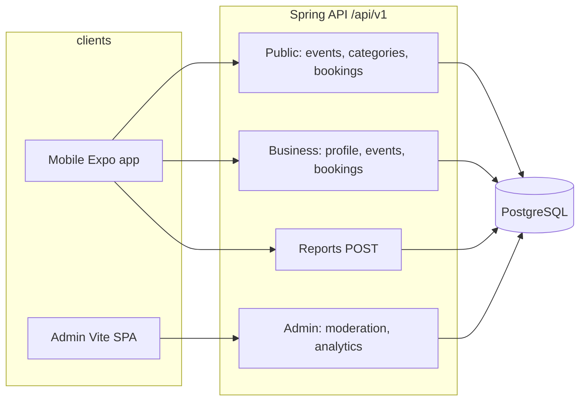
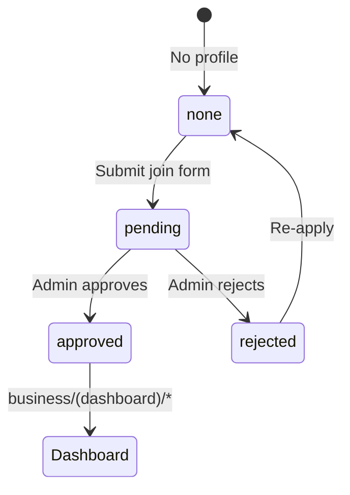
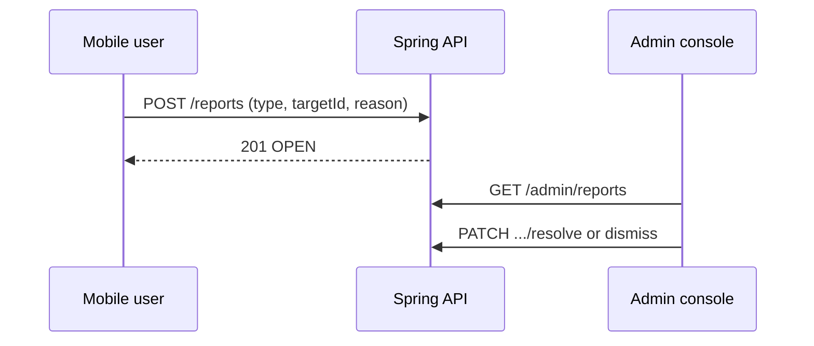
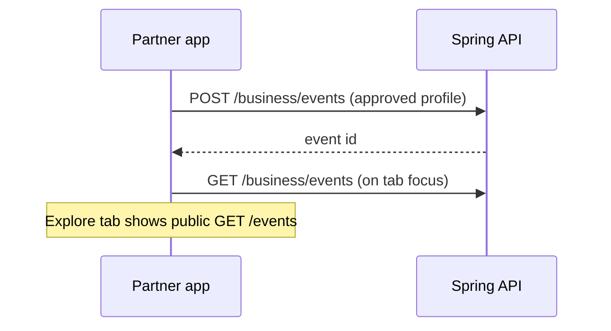
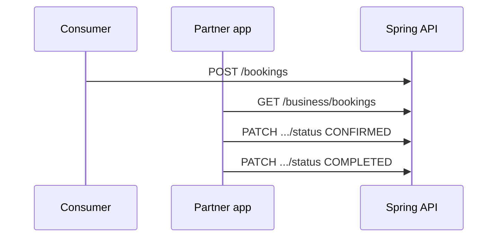

# Vibook — Mobile App & Admin Console Guide

This document describes what the **mobile app** (`mobile/`) and **admin web** (`admin-web/`) do, how they talk to the **Spring backend** (`backend/`), and where the main code lives. Use it for onboarding, demos, and handoff.

---

## 1. System overview




| Layer       | Tech                                          | Role                                                                     |
| ----------- | --------------------------------------------- | ------------------------------------------------------------------------ |
| **Mobile**  | Expo SDK 54, Expo Router, Zustand, TypeScript | Consumer discovery/booking + partner business hub                        |
| **Admin**   | React 19, Vite, React Router, Axios           | Operations: approve businesses, moderate events/bookings/ratings/reports |
| **Backend** | Spring Boot, JWT                              | Single source of truth for catalog, bookings, profiles, moderation       |


**Auth:** JWT access tokens. Mobile stores tokens via `authSession`; admin stores token in `localStorage` (`vibook_admin_access_token`).

---

## 2. Running locally

### Backend

Start the Spring API (default port **8080**, prefix `**/api/v1`**). See `backend/` README or your usual `mvn spring-boot:run`.

### Mobile

```bash
cd mobile
npm install
# mobile/.env — required:
# EXPO_PUBLIC_API_URL=http://YOUR_LAN_IP:8080/api/v1
npx expo start
```

- Use your machine’s **LAN IP**, not `localhost`, on a physical device.
- Media URLs from the API are resolved with `resolveBackendMediaUrl()` in `mobile/src/api/env.ts`.

### Admin web

```bash
cd admin-web
npm install
# admin-web/.env — see .env.example:
# VITE_API_BASE_URL=http://localhost:8080
npm run dev
```

- Log in with an **ADMIN** user created in the backend.
- API client: `admin-web/src/api/client.ts` (appends `/api/v1` if missing).

---

## 3. Mobile app

### 3.1 Consumer experience (tabs & stacks)


| Area              | Routes (examples)                                      | Backend                                        |
| ----------------- | ------------------------------------------------------ | ---------------------------------------------- |
| Explore / catalog | `app/(tabs)/explore.tsx`, PDP `event/[id].tsx`, etc.   | `GET /events`, filters, governorates           |
| Booking           | `checkout.tsx`, `confirmation.tsx`, `booking/[id].tsx` | `POST /bookings`, `GET /bookings/me`           |
| Favorites         | `(tabs)/favorites.tsx`                                 | `GET/POST/DELETE /favorites`                   |
| Account           | `settings.tsx`, `edit-profile.tsx`, payment methods    | `GET /users/me`, payment-methods APIs          |
| Ratings           | Event PDP `StarRatingInput`                            | `POST /events/{id}/rate`, `GET` rating summary |


Catalog mappers live under `mobile/src/services/api/` (e.g. `eventMap.ts`). Reference data (cities/governorates, categories) loads via `referenceStore` → `listActiveGovernorates`, `listCategories`.

### 3.2 User moderation reports (consumer)

Users can file complaints that appear in the admin **Reports** queue.


| UI                       | File                                                | API                                                  |
| ------------------------ | --------------------------------------------------- | ---------------------------------------------------- |
| Modal (reason + details) | `mobile/src/components/report/ReportIssueModal.tsx` | `POST /reports` via `reportsApi.ts`                  |
| Event PDP                | `mobile/app/event/[id].tsx`                         | `EVENT`, `RATING` (uses `myRatingId` from event DTO) |
| Booking detail           | `mobile/app/booking/[id].tsx`                       | `BOOKING`                                            |


**Report types** (`ModerationReportType`): `BOOKING`, `EVENT`, `USER`, `RATING`, `BUSINESS_PROFILE`, `OTHER`.

**Rules:**

- Signed-in **USER** or **ADMIN** can submit (`SecurityConfig`).
- All types except `OTHER` require a valid `targetId`; server validates the target exists.
- Copy is in `dictionary.ts` under `report.`* (EN/AR).

### 3.3 Business partner flow

Partners apply for a business profile, get approved by admin, then manage events and bookings.




| Step               | Screen                                                | API / store                                                |
| ------------------ | ----------------------------------------------------- | ---------------------------------------------------------- |
| Intro              | `app/business/index.tsx`                              | Redirects by `applicationStatus` in hub store              |
| Apply              | `app/business/join.tsx`                               | `PUT /business-profile/me`, governorates/categories        |
| Pending / rejected | `application-pending.tsx`, `application-rejected.tsx` | `GET /business-profile/me` → `syncBusinessApprovalFromApi` |
| Dashboard          | `business/(dashboard)/*`                              | Only if `applicationStatus === 'approved'`                 |


**Profile gate** is driven by `BusinessProfileResponseDto.status` mapped in `businessHubStore.syncBusinessApprovalFromApi`:


| Backend status   | Hub `applicationStatus`          |
| ---------------- | -------------------------------- |
| `DRAFT`          | `none`                           |
| `PENDING_REVIEW` | `pending`                        |
| `APPROVED`       | `approved`                       |
| `REJECTED`       | `rejected` (+ `rejectionReason`) |


Persisted in AsyncStorage key `**vibook-business-hub-v2`** (profile + listings only — **not** events/bookings).

### 3.4 Partner dashboard (live API data)

When the dashboard tab layout is focused, lists refresh from the server:


| Feature          | Screen             | API module                             | Sync                                   |
| ---------------- | ------------------ | -------------------------------------- | -------------------------------------- |
| Home stats       | `home.tsx`         | —                                      | Reads `events` / `bookings` from store |
| Events list      | `events/index.tsx` | `businessEventsApi.ts`                 | `refreshBusinessHubLists()`            |
| Event editor     | `events/[id].tsx`  | create/update/delete/get + hide/unhide | Same                                   |
| Bookings         | `bookings.tsx`     | `businessBookingsApi.ts`               | Same                                   |
| Business profile | `profile.tsx`      | `businessProfileApi.ts`                | Profile persisted separately           |


**Sync service:** `mobile/src/services/businessHubSync.ts`  

- Parallel `GET /business/events` + `GET /business/bookings`  
- Maps responses with `businessHubMappers.ts` into `BusinessEventRecord` / `BusinessBookingRecord`  
- Store: `replaceHubEvents`, `replaceHubBookings`  
- **Logout** clears in-memory events/bookings (`appStore.logout`).

**Partner events API** (`/business/events`):


| Method | Path                     | Mobile usage              |
| ------ | ------------------------ | ------------------------- |
| GET    | `/business/events`       | List on dashboard         |
| GET    | `/business/events/{id}`  | Editor load               |
| POST   | `/business/events`       | Create                    |
| PUT    | `/business/events/{id}`  | Save                      |
| DELETE | `/business/events/{id}`  | Delete                    |
| PATCH  | `.../hide`, `.../unhide` | Visibility toggle on list |


**Upsert body** (`BusinessEventUpsertPayload`): `subcategoryId`, `eventDate`, `timeSlots[]`, `governorateId`, `priceJod`, `capacityGuests`, `photoUrls` (HTTP paths only — `file://` stripped), `hidden`, etc.

**Editor helpers:**

- `resolveHubSubcategory.ts` — category picker label `"Category · Subcategory"` → `subcategoryId`
- `resolveGovernorateId.ts` — Jordan slug → governorate id
- `photoUrlsForApi()` — drops local file URIs

**Partner bookings API** (`/business/bookings`):


| Method | Path                             | Mobile usage              |
| ------ | -------------------------------- | ------------------------- |
| GET    | `/business/bookings`             | List                      |
| PATCH  | `/business/bookings/{id}/status` | Tap row to advance status |


**Status flow (partner tap):** `PENDING` → `CONFIRMED` → `COMPLETED` (`nextPartnerBookingStatus` in mappers). Cancel is not exposed on tap; admin can cancel from the console.

### 3.5 Key mobile files (quick index)

```
mobile/
├── app/
│   ├── (tabs)/              # Consumer tabs
│   ├── event/[id].tsx       # PDP + report + rating
│   ├── booking/[id].tsx     # Booking detail + report
│   └── business/
│       ├── join.tsx
│       └── (dashboard)/     # Partner hub
├── src/api/
│   ├── businessEventsApi.ts
│   ├── businessBookingsApi.ts
│   ├── businessProfileApi.ts
│   ├── reportsApi.ts
│   └── types.ts
├── src/store/
│   ├── businessHubStore.ts
│   └── appStore.ts
├── src/services/businessHubSync.ts
└── src/utils/businessHubMappers.ts
```

---

## 4. Admin web console

### 4.1 Navigation & routes

Defined in `admin-web/src/App.tsx`, shell in `DashboardShell.tsx`:


| Route                    | Page                        | Purpose                             |
| ------------------------ | --------------------------- | ----------------------------------- |
| `/dashboard`             | `DashboardPage`             | KPIs + charts                       |
| `/business-profiles`     | `BusinessProfilesPage`      | Review partner applications         |
| `/business-profiles/:id` | `BusinessProfileDetailPage` | Approve / reject                    |
| `/users`                 | `UsersPage`                 | User directory                      |
| `/events`                | `EventsPage`                | All platform events                 |
| `/events/:id`            | `EventDetailPage`           | Detail, notes, delete               |
| `/bookings`              | `BookingsPage`              | All bookings                        |
| `/bookings/:id`          | `BookingDetailPage`         | Cancel / complete                   |
| `/ratings`               | `RatingsPage`               | Event ratings moderation            |
| `/reports`               | `ReportsPage`               | **Moderation queue** (user reports) |
| `/reports/:id`           | `ReportDetailPage`          | Review / resolve / dismiss          |
| `/categories`            | `CategoriesPage`            | Categories & subcategories          |
| `/governorates`          | `GovernoratesPage`          | Governorate stats                   |
| `/activity-log`          | `ActivityLogPage`           | Admin audit trail                   |
| `/settings`              | `SettingsPage`              | Console settings                    |


All routes except `/login` are behind `ProtectedRoute` (JWT).

### 4.2 Moderation reports (admin)

**List:** `ReportsPage.tsx` — paginated `GET /admin/reports`, columns: reporter, type, target link, reason, status, created.

**Detail:** `ReportDetailPage.tsx` — actions:


| Action        | API                                 | Resulting status |
| ------------- | ----------------------------------- | ---------------- |
| Mark reviewed | `PATCH /admin/reports/{id}/review`  | `REVIEWED`       |
| Resolve       | `PATCH /admin/reports/{id}/resolve` | `RESOLVED`       |
| Dismiss       | `PATCH /admin/reports/{id}/dismiss` | `DISMISSED`      |


Optional **admin notes** on each action. **Status badges:** `ReportStatusBadge` in `Badge.tsx` (`OPEN`, `REVIEWED`, `RESOLVED`, `DISMISSED`).

**Target links** from report type:


| Type               | Admin link                      |
| ------------------ | ------------------------------- |
| `EVENT`            | `/events/{targetId}`            |
| `BOOKING`          | `/bookings/{targetId}`          |
| `USER`             | `/users?userId={targetId}`      |
| `RATING`           | `/ratings`                      |
| `BUSINESS_PROFILE` | `/business-profiles/{targetId}` |


API wrappers: `fetchAdminReportsPage`, `fetchAdminReport`, `reviewAdminReport`, `resolveAdminReport`, `dismissAdminReport` in `admin-web/src/api/adminApi.ts`.

### 4.3 Other admin capabilities (summary)


| Module            | Main APIs                                            | Typical actions                              |
| ----------------- | ---------------------------------------------------- | -------------------------------------------- |
| Business profiles | `/admin/business-profiles`                           | Filter, approve, reject, bulk approve/reject |
| Events            | `/admin/events`                                      | Search, detail, admin notes, delete          |
| Bookings          | `/admin/bookings`                                    | Filter, cancel with reason, mark complete    |
| Ratings           | `/admin/ratings`                                     | Hide/show, delete                            |
| Categories        | `/admin/categories`                                  | CRUD                                         |
| Dashboard         | `/admin/dashboard/stats`, `/admin/analytics/summary` | Charts on dashboard                          |
| Activity log      | `/admin/activity-log`                                | Filter by entity                             |


Types mirror backend DTOs in `admin-web/src/api/types.ts`.

### 4.4 Key admin files

```
admin-web/
├── src/App.tsx
├── src/api/
│   ├── client.ts          # Axios + JWT
│   ├── adminApi.ts        # All admin endpoints
│   └── types.ts
├── src/pages/
│   ├── ReportsPage.tsx
│   ├── ReportDetailPage.tsx
│   ├── BusinessProfilesPage.tsx
│   └── ...
└── src/components/ui/Badge.tsx   # ReportStatusBadge, etc.
```

---

## 5. Backend API reference (cross-cutting)

Base path: `**/api/v1**`.

### Consumer + shared


| Endpoint                          | Who            | Notes                                               |
| --------------------------------- | -------------- | --------------------------------------------------- |
| `POST /reports`                   | USER, ADMIN    | Creates `OPEN` report                               |
| `GET /events`, `GET /events/{id}` | Public / auth  | Catalog & PDP; includes `myRatingId` when logged in |
| `POST /events/{id}/rate`          | USER           | Rating row id used for `RATING` reports             |
| `POST /bookings`                  | USER           | Creates booking                                     |
| `GET /business-profile/me`        | Business owner | Application status                                  |


### Business owner


| Endpoint                               | Notes                                      |
| -------------------------------------- | ------------------------------------------ |
| `GET/POST/PUT/DELETE /business/events` | CRUD; create requires **approved** profile |
| `PATCH /business/events/{id}/hide      | unhide`                                    |
| `GET /business/bookings`               | Bookings for owner’s events                |
| `PATCH /business/bookings/{id}/status` | Partner status updates                     |


### Admin


| Endpoint                                     | Notes           |
| -------------------------------------------- | --------------- |
| `GET /admin/reports`                         | Paginated queue |
| `PATCH /admin/reports/{id}/review            | resolve         |
| `PATCH /admin/business-profiles/{id}/approve | reject`         |
| `PATCH /admin/bookings/{id}/cancel           | complete`       |


---

## 6. End-to-end flows

### 6.1 Report: mobile → admin




### 6.2 Partner event lifecycle




### 6.3 Partner booking status




---

## 7. Configuration checklist


| App     | Variable                     | Example                           |
| ------- | ---------------------------- | --------------------------------- |
| Mobile  | `EXPO_PUBLIC_API_URL`        | `http://192.168.1.10:8080/api/v1` |
| Admin   | `VITE_API_BASE_URL`          | `http://localhost:8080`           |
| Backend | DB, JWT secret, file storage | See backend config                |


---

## 8. Testing suggestions

**Mobile**

1. Sign in → open event PDP → submit report → confirm success toast.
2. Rate event → report rating (needs `myRatingId` from API).
3. Approved partner → create event → hide/unhide on list → edit → delete.
4. Partner bookings → tap pending → confirmed → completed.
5. Logout → hub events/bookings cleared.

**Admin**

1. Reports list shows mobile submissions.
2. Open report → follow target link → resolve/dismiss with notes.
3. Approve a pending business profile → partner sees dashboard on next `GET /business-profile/me` or tab focus.

**Regression**

- `cd mobile && npx tsc --noEmit`
- `cd admin-web && npm run build`

---

## 9. Related docs


| Doc                                   | Location                      |
| ------------------------------------- | ----------------------------- |
| Mobile architecture (routes, folders) | `mobile/docs/ARCHITECTURE.md` |
| Mobile README (run instructions)      | `mobile/README.md`            |
| Admin env example                     | `admin-web/.env.example`      |


---

*Last updated to reflect API-backed partner hub (events/bookings), user moderation reports, and admin report review workflow.*