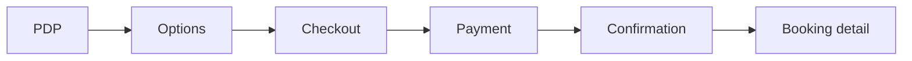

# Vibook — Product & Frontend Architecture

Production-oriented structure for a WeBook-style discovery and booking app (Expo + Expo Router). **No backend** in scope; models are mock/API-ready.

---

## 1. Full sitemap (hierarchy)

```
App
├── Splash
├── Onboarding
├── (auth) — optional pre-tabs
│   ├── Welcome
│   ├── Login
│   ├── Register
│   ├── ForgotPassword
│   └── VerifyOtp
├── (tabs) — main shell
│   ├── Home
│   ├── Explore
│   ├── Search
│   ├── Bookings
│   └── Profile
├── Discovery / catalog (stack modals or stacks)
│   ├── Event detail
│   ├── Experience detail
│   ├── Restaurant detail
│   ├── Hotel detail
│   ├── Package detail
│   └── Organizer / venue profile
├── Search & filters
│   ├── Filters (full-screen)
│   └── Map preview (optional)
├── Booking & commerce
│   ├── Booking options (tier / slot / room / pax)
│   ├── Checkout
│   ├── Payment method
│   ├── Order confirmation
│   └── Booking detail (ticket / QR placeholder)
├── Account
│   ├── Edit profile
│   ├── Favorites (unified or by type)
│   ├── Wallet
│   ├── Vouchers
│   ├── Notifications
│   ├── Settings
│   ├── Help
│   └── Language / region
└── Global
    ├── Offers / promotions list
    └── Not found / error boundary
```

**Navigation pattern:** Tabs stay the root; **detail and checkout** live in **parallel stacks** or **shared stack** above tabs so any tab can `push` the same detail routes (Expo Router: `app/(tabs)` + `app/(modals)` or single `app/_layout` with `Stack` wrapping groups).

---

## 2. Expo Router folder structure (recommended)

```
app/
├── _layout.tsx                 # Root: providers, fonts, error boundary
├── index.tsx                   # Splash → redirect
├── onboarding.tsx
├── +not-found.tsx
├── (auth)/
│   ├── _layout.tsx             # Stack
│   ├── welcome.tsx
│   ├── login.tsx
│   ├── register.tsx
│   ├── forgot-password.tsx
│   └── verify-otp.tsx
├── (tabs)/
│   ├── _layout.tsx             # Tabs
│   ├── index.tsx               # Home
│   ├── explore.tsx
│   ├── search.tsx
│   ├── bookings.tsx
│   └── profile.tsx
├── (booking)/                  # Shared booking + checkout (group)
│   ├── _layout.tsx             # Stack
│   ├── [bookingType]/
│   │   └── [id]/options.tsx    # Dynamic: event/restaurant/hotel…
│   ├── checkout.tsx
│   ├── payment.tsx
│   └── confirmation.tsx
├── event/
│   └── [id].tsx
├── experience/
│   └── [id].tsx
├── restaurant/
│   └── [id].tsx
├── stay/                       # hotels
│   └── [id].tsx
├── package/
│   └── [id].tsx
├── organizer/
│   └── [id].tsx
├── filters.tsx                 # Full-screen filters (modal presentation)
├── favorites.tsx
├── wallet.tsx
├── vouchers.tsx
├── notifications.tsx
├── settings.tsx
├── edit-profile.tsx
├── help.tsx
└── booking/
    └── [id].tsx                # Single booking detail
```

**Notes:**

- Use **`href` / `router.push`** from any screen: `/event/123`, `/checkout?bookingDraftId=…`.
- **`(booking)`** keeps checkout out of tabs to avoid duplicate headers and enables **clear back stack** to Home.
- Alternatively: **`app/(app)/_layout`** with nested stacks — pick one pattern and stay consistent.

---

## 3. Feature modules (domains)

| Domain | Responsibility | Main routes |
|--------|----------------|-------------|
| **Discovery** | Feed, hero, categories, editorial | `(tabs)/index`, `(tabs)/explore` |
| **Search** | Query, facets, results list | `(tabs)/search`, `filters.tsx` |
| **Commerce** | PDPs per vertical | `event/[id]`, `restaurant/[id]`, `stay/[id]`, `package/[id]` |
| **Booking** | Options → checkout → pay → confirm | `(booking)/*`, `booking/[id]` |
| **User** | Profile, wallet, vouchers, favorites, settings | `(tabs)/profile`, `wallet`, `favorites`, etc. |
| **Auth** | Identity (when backend exists) | `(auth)/*` |

---

## 4. Screen-by-screen (concise spec)

### Global

| Screen | Purpose | Key sections | Components | Actions | Nav |
|--------|-----------|--------------|------------|---------|-----|
| **Splash** | Brand, hydrate store | Logo, loader | — | Auto-advance | → Onboarding or Tabs |
| **Onboarding** | First-run value prop | Slides / bullets | `PrimaryButton` | Get started | → Tabs, persist flag |

### Tabs

| Screen | Purpose | Key sections | Components | Actions | Nav |
|--------|-----------|--------------|------------|---------|-----|
| **Home** | Discovery feed | Header, search, chips, hero, sections | `AppHeader`, `SearchBar`, `CategoryChip`, `HeroCarousel`, `SectionHeader`, `EventCard` | Tap search, chip, **any card** | → detail / search |
| **Explore** | Thematic browse | Hero, themes, grids | `CategoryChip`, `SectionHeader` | Tap category / tile | → filtered search or detail |
| **Search** | Find & narrow | Segments, recents, results | `SearchBar`, `SectionHeader`, list rows | Type query, segment, **result row** | → detail / filters |
| **Bookings** | Order history | Segments, cards | booking row component | Open booking, QR placeholder | → `booking/[id]` |
| **Profile** | Account hub | Header, stats, menu | avatar block, `PrimaryButton`, rows | Menu items | → wallet, settings, etc. |

### Detail screens (PDP)

| Screen | Purpose | Key sections | Components | Actions | Nav |
|--------|-----------|--------------|------------|---------|-----|
| **Event [id]** | Sell tickets | Hero, title+badge, datetime, venue, map preview, tiers, reviews | `Gallery` or hero image, `Badge`, `StickyBottomBar` | Select tier, qty, **Book** | → `options` or checkout |
| **Restaurant [id]** | Reservations | Gallery, cuisine, hours, slots, party size | chips, time list | Pick slot, **Reserve** | → checkout |
| **Stay [id]** | Rooms | Carousel, amenities, room cards, dates | image carousel, cards | Select room, dates, **Book** | → checkout |
| **Package [id]** | Travel bundle | Itinerary, inclusions, dates | sections | **Book** | → checkout |
| **Organizer [id]** | Trust & more events | Cover, follow, upcoming list | `EventCard` | Follow, open event | → event detail |

### Booking & commerce

| Screen | Purpose | Key sections | Actions | Nav |
|--------|-----------|--------------|---------|-----|
| **Options** | Variants (tier, time, room, pax) | Steppers, calendar | Continue | → checkout |
| **Checkout** | Review line items, fees, voucher | `PromoCodeInput`, breakdown | Apply code, **Pay** | → payment |
| **Payment** | Method selection | Cards, Apple Pay placeholders | Pay | → confirmation |
| **Confirmation** | Success state | Order #, CTAs | View booking, share | → `booking/[id]` or Home |
| **Booking [id]** | Post-purchase | QR placeholder, help | Download, support | — |

### Account

| Screen | Purpose | Key sections | Nav |
|--------|-----------|--------------|-----|
| **Favorites** | Saved items by type | tabs or sections | → PDPs |
| **Wallet** | Balance, history | list | — |
| **Vouchers** | Codes, redeem | cards | apply at checkout |
| **Settings** | Preferences | toggles | — |
| **Edit profile** | Form | fields | save |

---

## 5. Booking flow (step-by-step)

**A. Events / experiences / packages (similar)**

1. PDP → choose **tier** or **variant** + **quantity** (+ date if needed)  
2. **Options** screen (if complex) OR inline on PDP  
3. **Checkout** — line items, taxes, **voucher**, total  
4. **Payment**  
5. **Confirmation**  
6. **Booking detail** (ticket/QR placeholder)

**B. Restaurant**

1. PDP → **date**, **time slot**, **party size**  
2. Checkout → Payment → Confirmation → Booking detail

**C. Hotel**

1. PDP → **dates**, **guests**, **room type**  
2. Checkout → Payment → Confirmation

**Mermaid (conceptual)**



**UX rule:** Preserve a **draft** in Zustand (or React Context) with `bookingDraftId` so back navigation doesn’t lose selections before payment.

---

## 6. Component mapping (reuse)

| Component | Use on |
|-----------|--------|
| **EventCard** | Home, Explore, Search results (events), Organizer, Favorites |
| **CategoryChip** | Home row, Explore themes, Filters summary |
| **HeroCarousel** | Home hero, Offers strip (variant), optional PDP gallery teaser |
| **SearchBar** | Home (→ search focus), Search tab header, Explore optional |
| **SectionHeader** | Every horizontal/vertical section; PDP “Similar”, “Reviews” |
| **ShimmerLoader** | Any list/PDP while `isLoading`; prefer route-level suspense or manual `loading` flag |
| **EmptyState** / **ErrorState** | Search empty, Bookings empty, Favorites empty, API errors later |
| **StickyBottomBar** | All PDPs with primary CTA |
| **Badge** | Cards + PDP titles |

**Rule:** **Every tappable card** uses `href={{ pathname: '/event/[id]', params: { id } }}` (or `router.push`) — no dead pressables.

---

## 7. Data models (mock-friendly, JSON-like)

```json
{
  "User": {
    "id": "string",
    "name": "string",
    "email": "string",
    "phone": "string",
    "avatarUrl": "string",
    "cityId": "string",
    "membershipTier": "standard | gold | platinum",
    "walletBalance": 0,
    "preferredLanguage": "en | ar"
  },
  "Event": {
    "id": "string",
    "title": "string",
    "categoryId": "string",
    "cityId": "string",
    "organizerId": "string",
    "imageUrl": "string",
    "gallery": ["string"],
    "startAt": "ISO8601",
    "endAt": "ISO8601",
    "venueName": "string",
    "address": "string",
    "geo": { "lat": 0, "lng": 0 },
    "description": "string",
    "priceFrom": 0,
    "currency": "SAR",
    "rating": 0,
    "reviewCount": 0,
    "badge": "popular | limited | new | soldFast | exclusive | null",
    "ticketTiers": ["TicketTier"]
  },
  "TicketTier": {
    "id": "string",
    "eventId": "string",
    "name": "string",
    "price": 0,
    "currency": "string",
    "benefits": ["string"],
    "remaining": 0
  },
  "Restaurant": {
    "id": "string",
    "name": "string",
    "cuisineIds": ["string"],
    "cityId": "string",
    "imageUrl": "string",
    "priceLevel": 1,
    "rating": 0,
    "reviewCount": 0,
    "openingHours": "object or string",
    "badge": "string | null"
  },
  "Hotel": {
    "id": "string",
    "name": "string",
    "cityId": "string",
    "imageUrl": "string",
    "stars": 0,
    "priceFrom": 0,
    "currency": "string",
    "rating": 0,
    "amenityIds": ["string"]
  },
  "Booking": {
    "id": "string",
    "userId": "string",
    "vertical": "event | restaurant | hotel | experience | package",
    "refId": "string",
    "refTitle": "string",
    "imageUrl": "string",
    "status": "upcoming | past | cancelled | pending_payment",
    "startsAt": "ISO8601",
    "cityName": "string",
    "totalPaid": 0,
    "currency": "string",
    "lineItems": [],
    "voucherCode": "string | null"
  },
  "Voucher": {
    "id": "string",
    "code": "string",
    "title": "string",
    "discountValue": 0,
    "discountType": "percent | fixed",
    "expiresAt": "ISO8601",
    "redeemed": false
  }
}
```

Align existing `src/types` and `src/mock` with these shapes; add `vertical` + `lineItems` when you implement checkout.

---

## 8. UX rules (conversion-focused)

1. **One primary CTA per screen** on PDP (Book / Reserve).  
2. **Sticky bottom bar** on PDP + checkout with price + action.  
3. **No dead cards** — `onPress` → route with `id`.  
4. **Loading:** skeleton on first paint; **pull-to-refresh** on lists when API exists.  
5. **Errors:** inline on forms; **ErrorState** on failed fetch.  
6. **Back stack:** from Confirmation, back should not return to Payment — **replace** to Booking detail or Home.  
7. **Guest vs signed-in:** optional **Continue as guest** until checkout requires email (product decision).

---

## 9. Scaling later (without backend in this repo)

- **API layer:** `src/api/client.ts` + React Query for cache, retries, stale time.  
- **Auth:** secure token storage, refresh, protected `(booking)` routes.  
- **Feature flags:** remote config for sections on Home.  
- **Analytics:** funnel events `view_pdp`, `begin_checkout`, `purchase`.  
- **Deep links:** `vibook://event/123` aligned with `app/event/[id].tsx`.  
- **i18n:** `expo-localization` + copy files; mock names already EN/AR-ready in types.

---

*This document is the single source of truth for frontend structure; implement routes incrementally without renaming tabs unless product requires.*
